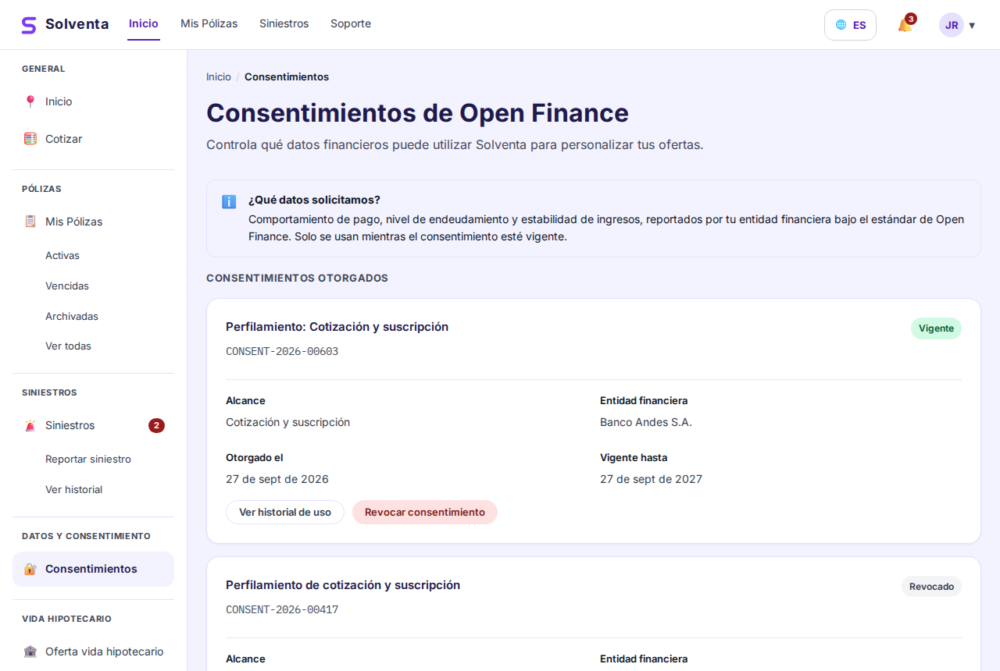
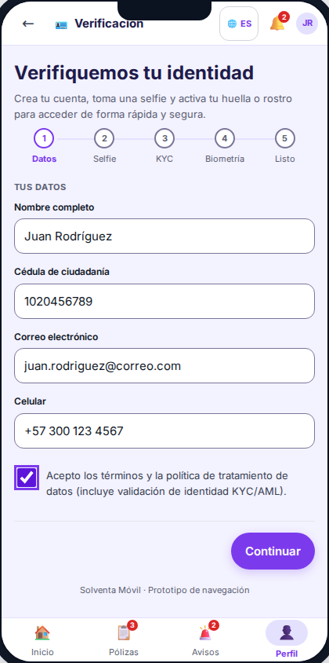
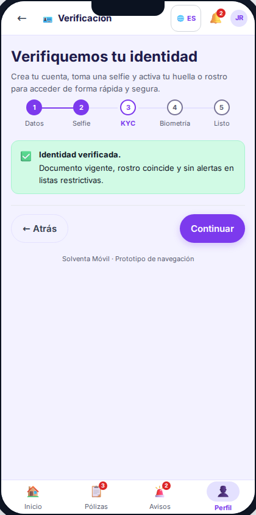
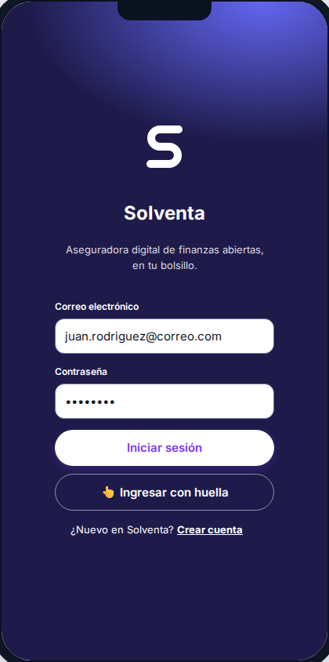
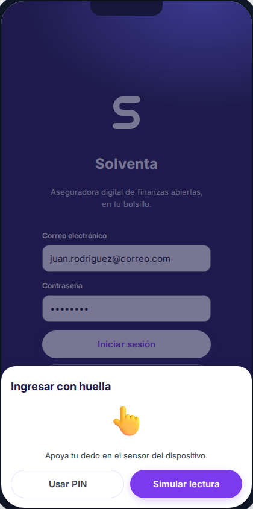
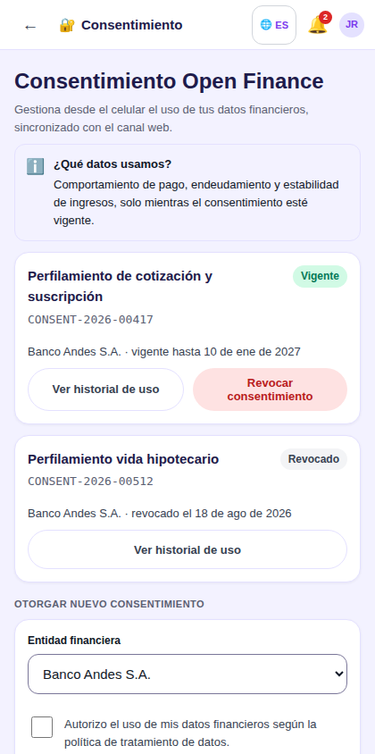

# Historias de Usuario Detalladas - Sprint 1 del Proyecto Final II

> **Proyecto:** Solventa · Aseguradora Digital de Finanzas Abiertas
> **Curso:** MISW4501 · Proyecto Final · Maestría en Ingeniería de Software · Universidad de los Andes
> **Grupo:** 13
> **Entregable:** Semana 8 de Proyecto Final I · Historias de usuario detalladas del Sprint 1 del Proyecto Final II

Sprint 1 abre el ciclo de construcción: dos semanas, 64 horas-equipo, **32 puntos** repartidos en
cuatro historias de arquitectura y dos historias funcionales que cierran, más tres que quedan en
curso. Al cierre, un cliente puede registrarse desde el móvil, verificar su identidad, entrar con su
huella, y otorgar y revocar su consentimiento de Open Finance con efecto real sobre el motor de
cotización.

Este documento detalla el Sprint 1 definido en
[`backlog-sprint-plan.md`](backlog-sprint-plan.md), con un ajuste de horas que se explica en la
sección [Ajuste respecto al plan del repositorio](#ajuste-respecto-al-plan-del-repositorio).

> **Ubicación de este archivo:** `docs/HISTORIAS_USUARIO_SPRINT_1.md`. Todas las rutas relativas de
> este documento (mockups, patrones, experimentos) están escritas desde `docs/`.

---

## Tabla de contenido

- [Objetivo del Sprint 1](#objetivo-del-sprint-1)
- [Backlog del Sprint 1](#backlog-del-sprint-1)
- [Mockups por historia](#mockups-por-historia)
- [Ajuste respecto al plan del repositorio](#ajuste-respecto-al-plan-del-repositorio)
- [Convenciones](#convenciones)
- [Historias de arquitectura](#historias-de-arquitectura)
  - [ARQ-01 · Esqueleto del monolito modular con fachada versionada](#arq-01--esqueleto-del-monolito-modular-con-fachada-versionada)
  - [ARQ-02 · Capa de adaptadores para integraciones externas](#arq-02--capa-de-adaptadores-para-integraciones-externas)
  - [ARQ-03 · Log de auditoría append-only](#arq-03--log-de-auditoría-append-only)
  - [ARQ-04 · Ambiente de trabajo DevOps](#arq-04--ambiente-de-trabajo-devops)
- [Historias funcionales que cierran](#historias-funcionales-que-cierran)
  - [WEB-F02 · Gestión del consentimiento Open Finance](#web-f02--gestión-del-consentimiento-open-finance)
  - [MOB-F01 · Onboarding y autenticación biométrica](#mob-f01--onboarding-y-autenticación-biométrica)
- [Historias funcionales en curso](#historias-funcionales-en-curso)
- [Trazabilidad a los requisitos de calidad](#trazabilidad-a-los-requisitos-de-calidad)
- [Asignación y orden de ejecución](#asignación-y-orden-de-ejecución)

---

## Objetivo del Sprint 1

**Objetivo del sprint:** dejar en pie el núcleo sobre el que se construye todo lo demás - la frontera
entre módulos, los adaptadores hacia terceros y el registro de auditoría - y con él entregar el
primer recorrido de negocio completo: **identidad verificada y consentimiento con efecto real**.

No es casualidad que el sprint empiece por ahí. El consentimiento de Open Finance es la puerta legal
de todo el modelo de negocio de Solventa: sin consentimiento vigente no hay perfilamiento con datos
reales, y sin perfilamiento la propuesta de valor se cae a una tarifa estándar. Y la identidad
verificada es la puerta de entrada al canal móvil. Las dos son prerrequisito de las cuatro historias
de prioridad Alta que siguen.

### Guión del demo de cierre

1. Una persona se registra en la app móvil, captura su documento y su selfie con la captura guiada, y
   el proveedor de KYC/AML simulado la aprueba.
2. Activa la biometría y vuelve a entrar con huella. Falla la lectura tres veces a propósito y la app
   ofrece el respaldo por PIN sin bloquear la cuenta.
3. Desde la web, la misma persona otorga consentimiento de Open Finance para la finalidad de
   cotización, con vigencia y alcance explícitos.
4. Se solicita una cotización: el motor obtiene el perfil de riesgo con datos financieros reales.
5. La persona revoca el consentimiento. Se vuelve a cotizar y el motor responde con **tarifa
   estándar**, indicándolo en la interfaz. Se mide el tiempo de propagación de la revocación:
   debe ser ≤ 5 minutos (RC-04).
6. Se abre el log de auditoría y se corre la verificación de la cadena de hash: cero eslabones rotos.
   Se altera un registro directamente en la base y la verificación señala exactamente ese registro.

### Fuera del Sprint 1, a propósito

Motor de cotización completo, suscripción y emisión, siniestros, billetera offline, tablero
operacional y back-office de socios. Cada uno entra en el sprint que le asigna el plan de 8 semanas.

---

## Backlog del Sprint 1

| ID | Historia | Tipo | Componente | Puntos | Horas | Prioridad | Responsable |
|---|---|---|---|---:|---:|---|---|
| ARQ-01 | Esqueleto del monolito modular con fachada versionada | Arquitectura | Backend | 2 | 4h | Crítica | Sergio |
| ARQ-02 | Capa de adaptadores para integraciones externas | Arquitectura | Backend | 2 | 4h | Crítica | Juan |
| ARQ-03 | Log de auditoría append-only | Arquitectura | Backend | 2 | 4h | Crítica | Sergio |
| ARQ-04 | Ambiente de trabajo DevOps | Arquitectura | Transversal | 5 | 8h | Crítica | Juan |
| WEB-F02 | Gestión del consentimiento Open Finance | Funcional | Web + Backend | 8 | 12h | Alta | Sergio + Harold |
| MOB-F01 | Onboarding y autenticación biométrica | Funcional | Móvil + Backend | 13 | 18h | Alta | Edwin + Juan |
| | **Cierran en el Sprint 1** | | | **32** | **50h** | | |
| WEB-F01 | Cotización y oferta personalizada *(rebanada: UI del cotizador)* | Funcional | Web | 13 | 8h | Alta | Harold |
| WEB-F03 | Suscripción y emisión *(rebanada: UI de checkout)* | Funcional | Web | 13 | 4h | Alta | Harold |
| MOB-F02 | Consentimiento Open Finance móvil *(rebanada: pantalla)* | Funcional | Móvil | 5 | 2h | Alta | Edwin |
| | **En curso, cierran en sprints siguientes** | | | - | **14h** | | |
| | **Total del sprint** | | | **32** | **64h** | | |

Las tres historias en curso no suman puntos a este sprint: en Scrum solo puntúa lo que cumple la
definición de hecho. Sus horas sí se consumen, y por eso aparecen en la tabla.

---

## Mockups por historia

Todas las pantallas del Sprint 1 ya están diseñadas y navegables. Las capturas viven en
[`guia-de-usuario/img/`](guia-de-usuario/img/) y los prototipos navegables en `web/` y `mobile/`, con
el estado compartido entre pantallas mediante `sessionStorage`.

| Historia | Capturas | Prototipo navegable |
|---|---|---|
| ARQ-01 · Esqueleto del monolito modular | *No aplica* | - |
| ARQ-02 · Capa de adaptadores | *No aplica* | - |
| ARQ-03 · Log de auditoría | *No aplica* | - |
| ARQ-04 · Ambiente DevOps | *No aplica* | - |
| **WEB-F02** · Consentimiento Open Finance | [`web-consentimientos.png`](guia-de-usuario/img/web-consentimientos.png) | [`web/consentimientos.html`](../web/consentimientos.html) |
| **MOB-F01** · Onboarding y biometría | [`mob-registro.png`](guia-de-usuario/img/mob-registro.png) · [`mob-kyc.png`](guia-de-usuario/img/mob-kyc.png) · [`mob-login.png`](guia-de-usuario/img/mob-login.png) · [`mob-login-huella.png`](guia-de-usuario/img/mob-login-huella.png) | [`mobile/onboarding.html`](../mobile/onboarding.html) · [`mobile/login.html`](../mobile/login.html) |
| WEB-F01 · Cotización *(rebanada)* | [`web-cotizacion-oferta.png`](guia-de-usuario/img/web-cotizacion-oferta.png) | [`web/cotizacion.html`](../web/cotizacion.html) |
| WEB-F03 · Suscripción *(rebanada)* | [`web-suscripcion-decision.png`](guia-de-usuario/img/web-suscripcion-decision.png) · [`web-suscripcion-emitida.png`](guia-de-usuario/img/web-suscripcion-emitida.png) | [`web/suscripcion.html`](../web/suscripcion.html) |
| MOB-F02 · Consentimiento móvil *(rebanada)* | [`mob-consentimiento.png`](guia-de-usuario/img/mob-consentimiento.png) **(nueva)** | [`mobile/consentimiento.html`](../mobile/consentimiento.html) |

Las cuatro historias de arquitectura no tienen mockup porque no tienen interfaz de usuario: su
resultado se verifica con pruebas automatizadas, con la verificación de integridad de la cadena de
hash y con el propio pipeline, no mirando una pantalla.

La captura `mob-consentimiento.png` se agregó en esta entrega: la pantalla
[`mobile/consentimiento.html`](../mobile/consentimiento.html) ya existía en el prototipo, pero la guía
de usuario no la documentaba porque el capítulo móvil no cubría el consentimiento. Se generó con el
mismo procedimiento y el mismo tamaño (420 × 844) que las demás capturas móviles.

---

## Ajuste respecto al plan del repositorio

El plan de 8 semanas del repositorio reparte 154 puntos de **features** en 256 horas, con las horas
de cada sprint sumando exactamente el presupuesto del equipo. Eso deja **cero horas para el trabajo
de arquitectura y de ambiente**, que sin embargo es real y es prerrequisito: no se puede construir el
servicio de consentimiento sin que existan la frontera de módulos, la capa de adaptadores y el log de
auditoría donde ese servicio escribe.

Lo que se hizo aquí es hacer explícito ese trabajo, no agregarlo: buena parte estaba implícito dentro
de las horas de las features. El ajuste concreto:

| | Plan original | Este documento |
|---|---|---|
| Sergio | Consentimiento 10h · Motor de cotización, avance 6h | ARQ-01 4h · ARQ-03 4h · Consentimiento 8h |
| Juan | Hook KYC/AML 6h · Servicio de siniestros: reporte 10h | ARQ-04 8h · ARQ-02 4h · Hook KYC/AML 4h |
| Harold | *(sin cambios)* | UI consentimiento 4h · UI cotizador 8h · UI checkout 4h |
| Edwin | *(sin cambios)* | Onboarding biométrico 14h · Consentimiento móvil 2h |

**Lo que se movió al Sprint 2:** el avance del motor de cotización (6h de Sergio) y el arranque del
servicio de siniestros (10h de Juan).

**La consecuencia, dicha con claridad:** el Sprint 2 pasa de 64h de features a 80h de features, lo
cual no cabe. La recomendación es que **WEB-F05 · Reporte de siniestro asistido** se desplace del
Sprint 2 al Sprint 3, y que el Sprint 4 absorba el corrimiento recortando WEB-F11 · Back-office de
socios, que es lo que el propio plan ya identificó como primer candidato a recorte por no tocar
ningún recorrido crítico del caso.

**Lo que se gana a cambio:** tres mecanismos de arquitectura ya validados quedan en el núcleo desde la
semana 2 en vez de improvisarse después, y las historias de arquitectura quedan documentadas y
estimadas, que es criterio explícito de evaluación.

Una parte importante del trabajo de ARQ-03 y ARQ-02 es **reutilización, no construcción**: los
experimentos de arquitectura de este mismo repositorio
([`solventa-experiments/`](../solventa-experiments/)) ya construyeron y depuraron el circuit breaker con
presupuesto de 700 ms, el consumidor idempotente, el log de auditoría con cadena de hash y la
revocación de consentimiento propagada. Ese código se lleva al núcleo; no se vuelve a inventar. Por
eso ARQ-02 y ARQ-03 valen 2 puntos y no 5.

---

## Convenciones

### Escala de estimación

Planning poker con escala Fibonacci (1, 2, 3, 5, 8, 13), la misma con la que se estimaron las 20
features del backlog. Un punto equivale a unas **2 horas-persona**, que es la relación que resulta del
backlog completo (154 puntos en 256 horas). Toda historia de más de 13 puntos se parte antes de entrar
al sprint.

### Definición de listo

Una historia entra al sprint solo si cumple todo esto:

- Está escrita en formato *Como / quiero / para*, con un actor real del caso Solventa.
- Tiene al menos tres criterios de aceptación en formato *Dado / Cuando / Entonces*, verificables sin
  ambigüedad.
- Está estimada por el equipo en planning poker.
- Tiene sus dependencias identificadas.
- Tiene identificado el requisito de calidad que favorece, cuando aplica.

### Definición de hecho

Una historia se cierra solo si cumple todo esto:

- [ ] Código en `main` por pull request aprobado por otro integrante
- [ ] Pruebas unitarias del código nuevo, con cobertura del código nuevo ≥ 70%
- [ ] Pruebas de integración contra los adaptadores simulados
- [ ] Desplegada y funcionando en el ambiente de *staging*
- [ ] Criterios de aceptación verificados por alguien distinto de quien la implementó
- [ ] Accesibilidad verificada: navegación por teclado y contraste AA en las pantallas tocadas
- [ ] Cadenas de texto externalizadas (i18n), sin literales incrustados en la interfaz
- [ ] Issue del tablero en *Done*, con sus commits enlazados

### Cómo leer cada historia

Cada una trae la historia en formato *Como / quiero / para*, el contexto mínimo para entenderla, los
criterios de aceptación numerados, notas técnicas, los patrones de interfaz aplicados (con el código
del [catálogo de patrones UI/UX](patrones-ui-ux.md)) y una ficha con puntos, horas, responsable,
dependencias y requisito de calidad favorecido.

Las historias se escribieron contra los criterios con los que el curso las revisa: son
**independientes** salvo por las dependencias declaradas, **negociables** en la implementación (ningún
criterio dice cómo, solo qué), **valiosas** para un actor concreto del caso, **estimables**,
**pequeñas** y **comprobables** (todo criterio se puede convertir en una prueba automatizada).

---

## Historias de arquitectura

### ARQ-01 · Esqueleto del monolito modular con fachada versionada

**Como** equipo de desarrollo, **quiero** un núcleo con una frontera de módulo por capacidad de
negocio y una fachada versionada hacia afuera, **para** que cada dominio evolucione sin romper a los
clientes ni a los demás módulos.

El estilo elegido para el núcleo transaccional es **monolito modular**: una frontera por capacidad de
negocio, sin la complejidad operativa de microservicios. La fachada es lo que permite reestructurar
por dentro sin romper la web, el móvil ni los socios embebidos. Es la decisión que sostiene la meta de
"nuevo ramo de seguro en ≤ 2 semanas-equipo, sin tocar el núcleo".

**Criterios de aceptación**

1. Dado el repositorio, cuando se inspecciona el núcleo, entonces existe un módulo por capacidad de
   negocio (identidad, consentimiento, perfilamiento, cotización, suscripción, pólizas, siniestros,
   pagos, socios) y cada uno expone únicamente su interfaz pública.
2. Dado un módulo, cuando intenta importar una clase interna de otro módulo, entonces la verificación
   de dependencias del pipeline falla el build e indica la importación prohibida.
3. Dado un consumidor de la API, cuando llama `/v1/...`, entonces la respuesta cumple el contrato
   publicado; un cambio incompatible obliga a publicar `/v2/...` sin retirar `/v1/`.
4. Dado el núcleo desplegado, cuando se consulta `/salud`, entonces reporta el estado de cada módulo y
   de cada dependencia externa por separado.
5. Dado un módulo nuevo creado desde la plantilla, cuando se agrega, entonces queda registrado en la
   fachada sin modificar ningún módulo existente.

**Notas técnicas.** Cada módulo con su propio esquema en la base (*database per bounded context*), de
modo que la evolución del esquema de un dominio no impacte a los demás. La verificación de
dependencias corre como un paso del pipeline, no como una convención de palabra.

**Favorece** RC-05 Modificabilidad · **Patrones** Monolito modular, Fachada
**Mockup** No aplica: historia de arquitectura sin interfaz de usuario
**Puntos** 2 · **Horas** 4h · **Responsable** Sergio · **Depende de** ARQ-04

---

### ARQ-02 · Capa de adaptadores para integraciones externas

**Como** equipo de desarrollo, **quiero** que toda integración externa pase por un adaptador con
contrato propio, **para** que un cambio en la API de un tercero no obligue a tocar ningún módulo del
núcleo.

En este prototipo, Open Finance, KYC/AML, la pasarela de pago y la firma electrónica están simulados.
Los adaptadores existen precisamente para que la simulación de hoy y el proveedor real de mañana sean
intercambiables sin que el núcleo se entere. Es también lo que sostiene la meta de "alta de un nuevo
socio embebido en ≤ 1 semana".

**Criterios de aceptación**

1. Dado el código del núcleo, cuando se busca una referencia a un proveedor externo concreto, entonces
   no existe ninguna: el núcleo solo conoce las interfaces `ProveedorOpenFinance`, `ProveedorKYC`,
   `PasarelaPago` y `ServicioFirma`.
2. Dado el entorno configurado con integraciones simuladas, cuando se ejecutan las pruebas, entonces
   todos los adaptadores responden con datos deterministas, aptos para usarse como aserción.
3. Dado un cambio en el contrato de una API externa, cuando se implementa, entonces los archivos
   modificados están todos dentro de la carpeta de adaptadores. Cero cambios en los módulos del
   núcleo.
4. Dado un adaptador que falla o excede su tiempo límite, cuando el núcleo lo invoca, entonces recibe
   un error tipado del dominio y no una excepción del cliente HTTP.
5. Dado el adaptador de Open Finance, cuando se invoca, entonces respeta el presupuesto de 700 ms,
   corta con circuit breaker cuando el proveedor se degrada, y expone métricas de latencia y de tasa
   de error.

**Notas técnicas.** El circuit breaker con presupuesto de 700 ms y el retroceso a caché ya se
construyeron y se midieron en
[`solventa-experiments/exp01-resiliencia`](../solventa-experiments/exp01-resiliencia). Esta historia lo
lleva al núcleo detrás de la interfaz del adaptador. Los escenarios de WireMock del experimento
(sano, degradado, caído) se reutilizan como pruebas de integración.

**Favorece** RC-05 Modificabilidad, RC-06 Integración, RC-03 Disponibilidad ·
**Patrones** Adapter, Circuit Breaker
**Mockup** No aplica: historia de arquitectura sin interfaz de usuario
**Puntos** 2 · **Horas** 4h · **Responsable** Juan · **Depende de** ARQ-01

---

### ARQ-03 · Log de auditoría append-only

**Como** oficial de cumplimiento de Solventa, **quiero** que toda decisión de pricing y de suscripción
y todo evento de consentimiento queden en un registro inmutable y verificable, **para** poder
demostrar ante la Superintendencia Financiera qué se decidió, con qué datos y bajo qué autorización.

El mecanismo ya se construyó y se depuró durante los experimentos de arquitectura de este ciclo,
incluido el defecto de concurrencia que producía falsos eslabones rotos en la cadena de hash cuando
varios procesos escribían al tiempo. Esta historia es llevar ese código al núcleo, no inventarlo.

**Criterios de aceptación**

1. Dada una decisión de cotización o de suscripción, cuando se emite, entonces queda un registro con
   `id_decision`, `version_regla`, `variables_entrada`, resultado, actor, canal y marca de tiempo.
2. Dado un registro del log, cuando se intenta un `UPDATE`, un `DELETE` o un `TRUNCATE` con cualquier
   rol de aplicación, entonces la base de datos lo rechaza. La protección es de tres capas: permisos
   de rol, triggers y encadenamiento por hash.
3. Dado el log completo, cuando se corre la verificación de integridad, entonces reporta cero
   eslabones rotos.
4. Dado un registro alterado directamente en la base con privilegios de administrador, cuando se corre
   la verificación, entonces señala exactamente ese registro y ninguno más.
5. Dadas veinte escrituras concurrentes, cuando terminan, entonces la cadena permanece consistente y
   la verificación sigue dando conforme. *(Este criterio existe porque es justo lo que falló en el
   experimento y se corrigió.)*
6. Dado un evento de consentimiento, cuando ocurre, entonces el log guarda además la versión del texto
   legal que el cliente aceptó.

**Notas técnicas.** Reutiliza
[`solventa-experiments/exp04-auditoria`](../solventa-experiments/exp04-auditoria), incluida la corrección
del número de secuencia asignado dentro del *advisory lock* e incluido en el hash. La escritura del
log es asíncrona respecto del camino del usuario, para no cargar la latencia de la cotización.

**Favorece** RC-05 Auditabilidad, RC-08 Trazabilidad y explicabilidad ·
**Patrones** Audit log append-only, event sourcing parcial
**Mockup** No aplica: historia de arquitectura sin interfaz de usuario
**Puntos** 2 · **Horas** 4h · **Responsable** Sergio · **Depende de** ARQ-01

---

### ARQ-04 · Ambiente de trabajo DevOps

**Como** equipo de desarrollo, **quiero** el repositorio, la integración continua y el ambiente local
montados antes de escribir la primera línea de negocio, **para** que todo el trabajo del ciclo quede
trazable y no haya que retroceder a instrumentar cuando ya haya código.

Es la primera historia del sprint y bloquea a todas las demás. También es la que sostiene la mayor
parte de la evaluación de la primera semana del ciclo de construcción.

**Criterios de aceptación**

1. Dado `main`, cuando alguien intenta empujar directo, entonces la plataforma lo rechaza. Todo entra
   por pull request, con el pipeline en verde y una aprobación de otro integrante.
2. Dado un pull request, cuando corre el pipeline, entonces ejecuta lint, pruebas unitarias y publica
   la cobertura; el merge se bloquea si la cobertura del código nuevo baja del 70%.
3. Dado un commit cuyo mensaje no sigue la convención acordada ni referencia una historia del tablero,
   cuando se intenta empujar, entonces el hook lo rechaza e indica el formato esperado.
4. Dado un desarrollador con Docker, cuando ejecuta `docker compose up`, entonces quedan corriendo el
   núcleo, PostgreSQL, Redis, el bus de eventos y los adaptadores simulados, con las migraciones ya
   aplicadas y datos de prueba cargados.
5. Dado un merge a `main`, cuando termina el pipeline, entonces la imagen queda publicada y desplegada
   en el ambiente de *staging* sin intervención manual.
6. Dado el cierre del sprint, cuando se consulta el tablero, entonces el burndown, el velocity y el
   value chart se generan desde los datos ya registrados, sin trabajo manual de última hora.

**Notas técnicas.** El Terraform de
[`solventa-experiments/terraform`](../solventa-experiments/terraform) se reutiliza como base de la
infraestructura de *staging*. La estrategia de ramas es trunk-based con ramas cortas y versionamiento
semántico por release, etiquetando al cierre de cada sprint.

**Favorece** habilitador transversal de todos los RC
**Mockup** No aplica: historia de arquitectura sin interfaz de usuario
**Puntos** 5 · **Horas** 8h · **Responsable** Juan · **Depende de** nada

---

## Historias funcionales que cierran

### WEB-F02 · Gestión del consentimiento Open Finance

**Como** cliente de Solventa, **quiero** otorgar, consultar y revocar mi consentimiento para que
Solventa consulte mi información financiera, **para** controlar en todo momento quién usa mis datos y
con qué finalidad.

Esta historia es la puerta legal de todo el modelo de negocio. El perfilamiento de riesgo con datos
reales, la propuesta de valor de Solventa, solo es lícito bajo consentimiento explícito, informado y
revocable, según el Decreto 1297 de 2022 y la Circular Externa 004 de 2024 de la SFC. Sin
consentimiento vigente, la cotización cae a tarifa estándar.

**Criterios de aceptación**

1. Dado un cliente autenticado sin consentimiento vigente, cuando entra a la pantalla de
   consentimientos, entonces ve cada finalidad por separado (cotización, suscripción, prevención de
   fraude) con su alcance, su vigencia y las entidades origen de los datos, y **ninguna casilla viene
   marcada por defecto**.
2. Dado que el cliente selecciona una finalidad y confirma, cuando se otorga el consentimiento,
   entonces queda registrado con finalidad, alcance, vigencia, canal, fecha y hora, y la interfaz
   muestra el estado *Vigente* con su fecha de expiración.
3. Dado un consentimiento vigente, cuando el cliente lo revoca, entonces el estado cambia a *Revocado*
   de inmediato en la interfaz y **la revocación es efectiva en toda la plataforma en ≤ 5 minutos**,
   medidos desde la confirmación (RC-04).
4. Dado un consentimiento revocado, cuando el motor de cotización solicita el perfil de riesgo del
   cliente, entonces el servicio responde sin datos de Open Finance, la cotización se calcula con
   tarifa estándar y la interfaz lo indica de forma explícita.
5. Dado un consentimiento revocado, cuando se inspecciona la caché de perfil, entonces no queda
   ninguna copia del perfil financiero de ese cliente disponible para uso posterior.
6. Dado cualquier otorgamiento, renovación o revocación, cuando ocurre, entonces queda un registro en
   el log de auditoría con actor, finalidad, canal, marca de tiempo y la **versión del texto de
   consentimiento** que el cliente aceptó (RC-05).
7. Dado un consentimiento próximo a vencer, cuando faltan 30 días, entonces el cliente ve el aviso en
   la pantalla y puede renovarlo sin repetir el flujo completo.
8. Dado un cliente que consulta el histórico, cuando abre el detalle, entonces ve todos los eventos de
   su consentimiento en orden cronológico, incluidos los revocados y los vencidos.
9. Dado un cliente que va a revocar, cuando confirma, entonces la interfaz le explica primero la
   consecuencia concreta, que sus próximas cotizaciones usarán tarifa estándar, y le pide una
   confirmación explícita.

**Notas técnicas.** El criterio 5 es el que hace real al criterio 3: sin invalidar la caché, una
revocación se ve en la interfaz pero el perfil financiero sigue sirviéndose desde Redis. Este defecto
se detectó y se corrigió durante los experimentos del ciclo, y por eso está escrito como criterio
propio. La propagación usa el evento `consentimiento-revocado` sobre el bus; el servicio de
perfilamiento se entera por ese evento y no por consulta directa.

**Patrones de interfaz.** P08 Consentimiento explícito y revocable · P07 Confirmación de acciones
destructivas o irreversibles · P17 Trazabilidad visible · P06 Validación en línea.
**Mockup.** [`web-consentimientos.png`](guia-de-usuario/img/web-consentimientos.png) · prototipo
navegable en [`web/consentimientos.html`](../web/consentimientos.html).

**Favorece** RC-04 Seguridad y privacidad, RC-05 Auditabilidad ·
**Puntos** 8 · **Horas** 12h (Sergio 8h backend, Harold 4h UI) ·
**Depende de** ARQ-01, ARQ-02, ARQ-03

---

### MOB-F01 · Onboarding y autenticación biométrica

**Como** persona que quiere asegurarse desde el celular, **quiero** registrarme, verificar mi
identidad y entrar después con mi huella o mi rostro, **para** empezar a usar Solventa sin papeleo y
sin tener que recordar una contraseña.

Es la puerta de entrada del canal móvil y la historia más grande del sprint. Dos cosas la hacen
delicada: la verificación de identidad involucra a un tercero (KYC/AML) que puede fallar o tardar, y
la biometría depende de un sensor que puede no existir o no funcionar. En ambos casos el usuario tiene
que quedar con un camino alternativo, nunca bloqueado.

**Criterios de aceptación**

1. Dado un usuario nuevo, cuando completa el registro con su correo y su documento, entonces recibe un
   código de verificación y la cuenta queda creada en estado *Pendiente de verificación*, sin acceso a
   funciones que requieran identidad verificada.
2. Dado un usuario en verificación, cuando captura su documento y su selfie con la captura guiada,
   entonces la app valida encuadre, enfoque e iluminación **antes** de enviar, e indica qué corregir
   cuando algo falla.
3. Dado un documento y una selfie capturados, cuando se envía la verificación KYC/AML, entonces el
   proveedor responde aprobado, rechazado o en revisión manual, y el usuario ve el resultado con el
   siguiente paso concreto para cada caso.
4. Dado un usuario verificado, cuando el dispositivo tiene biometría disponible, entonces la app le
   ofrece activarla explicando qué implica, y al aceptar las siguientes entradas se hacen con huella o
   rostro.
5. Dado un usuario con biometría activa, cuando la lectura falla tres veces o el sensor no está
   disponible, entonces la app ofrece el respaldo por contraseña o PIN **sin bloquear la cuenta**.
6. Dado un usuario que niega el permiso de cámara, cuando llega al paso de captura, entonces la app
   explica para qué la necesita y ofrece una alternativa, en lugar de quedarse en un callejón sin
   salida.
7. Dada una verificación rechazada, cuando el usuario la consulta, entonces ve el motivo en lenguaje
   claro y cómo reintentar, sin jerga del proveedor ni códigos de error.
8. Dado el proveedor de KYC/AML caído o lento, cuando el usuario envía su verificación, entonces la
   solicitud queda encolada, el usuario recibe confirmación de recepción, y se le notifica cuando haya
   resultado. La app no lo deja esperando en una pantalla de carga indefinida.
9. Dado cualquier intento de verificación, cuando ocurre, entonces queda en el log de auditoría con
   resultado, proveedor, canal y marca de tiempo.

**Notas técnicas.** El proveedor de KYC/AML está simulado detrás del adaptador `ProveedorKYC` de
ARQ-02, con escenarios de aprobación, rechazo, revisión manual y caída. La biometría se resuelve con
el almacén seguro del dispositivo: **Solventa nunca recibe el dato biométrico**, solo el resultado de
la verificación local, lo cual es también lo que hace que el criterio 5 sea posible sin comprometer
seguridad.

**Patrones de interfaz.** P04 Asistente paso a paso con puertas de validación · P21 Captura guiada ·
P22 Autenticación biométrica con respaldo · P20 Permiso en contexto con alternativa · P06 Validación
en línea · P14 Degradación elegante.
**Mockups.** [`mob-registro.png`](guia-de-usuario/img/mob-registro.png) ·
[`mob-kyc.png`](guia-de-usuario/img/mob-kyc.png) ·
[`mob-login.png`](guia-de-usuario/img/mob-login.png) ·
[`mob-login-huella.png`](guia-de-usuario/img/mob-login-huella.png) · prototipo navegable en
[`mobile/onboarding.html`](../mobile/onboarding.html) y
[`mobile/login.html`](../mobile/login.html).

| 1. Registro | 2. Verificación KYC | 3. Ingreso | 4. Ingreso con huella |
|---|---|---|---|
|  |  |  |  |

**Favorece** RC-04 Seguridad, RC-03 Disponibilidad (criterio 8), RC-05 Auditabilidad ·
**Puntos** 13 · **Horas** 18h (Edwin 14h móvil, Juan 4h hook KYC/AML) ·
**Depende de** ARQ-02, ARQ-03

---

## Historias funcionales en curso

Estas tres historias arrancan en el Sprint 1 y cierran después. Su rebanada de este sprint tiene
criterios propios, para que el avance sea verificable y no una declaración de buena voluntad.

### WEB-F01 · Cotización y oferta personalizada *(rebanada: interfaz del cotizador)*

**Historia completa.** Como cliente, quiero cotizar un seguro indicando qué quiero asegurar y recibir
una oferta con precio personalizado y explicado, para decidir con información y no a ciegas.

**Rebanada del Sprint 1.** Las pantallas del asistente de cotización, navegables contra respuestas
simuladas, con la explicabilidad del precio y la degradación elegante ya representadas en la interfaz.

1. Dado el asistente de cotización, cuando el cliente recorre los pasos de producto, datos y oferta,
   entonces cada paso valida antes de avanzar y el cliente puede volver sin perder lo ya diligenciado.
2. Dada una oferta mostrada, cuando el cliente abre el detalle del precio, entonces ve qué factores lo
   componen y cuánto pesa cada uno.
3. Dada una oferta calculada sin datos de Open Finance, cuando se muestra, entonces la interfaz indica
   que se usó tarifa estándar y por qué, sin presentarlo como un error.
4. Dada una oferta emitida, cuando pasa su vigencia, entonces la interfaz lo refleja y ofrece
   recotizar.

**Cierra en el Sprint 2** con el motor de cotización, la integración real con el perfil de riesgo y el
presupuesto de latencia p95 ≤ 250 ms.

**Patrones.** P04, P05 Tarjetas de opción, P15 Oferta con vigencia, P16 Explicabilidad del precio,
P14 Degradación elegante.
**Mockup.** [`web-cotizacion-oferta.png`](guia-de-usuario/img/web-cotizacion-oferta.png) · prototipo
navegable en [`web/cotizacion.html`](../web/cotizacion.html).
**Puntos** 13 (completa) · **Horas en el Sprint 1** 8h · **Responsable** Harold

---

### WEB-F03 · Suscripción y emisión de póliza *(rebanada: interfaz de checkout)*

**Historia completa.** Como cliente, quiero aceptar la oferta, pagar y firmar para recibir mi póliza
emitida en minutos y no en días.

**Rebanada del Sprint 1.** El armazón de la pantalla de checkout con los estados de la transacción
representados.

1. Dado el checkout, cuando el cliente envía el pago, entonces el botón queda en estado ocupado y no
   permite un segundo envío.
2. Dado un reintento del cliente sobre la misma operación, cuando ocurre, entonces la interfaz comunica
   que la solicitud ya está en curso y no genera un segundo cobro.
3. Dado el flujo de suscripción, cuando el cliente lo recorre, entonces las migas de pan muestran en
   qué paso está y cómo volver.

**Cierra en el Sprint 3** con el motor de suscripción, la pasarela de pago, la firma electrónica y la
emisión.

**Patrones.** P04, P10 Botón ocupado, P18 Idempotencia comunicada, P02 Migas de pan.
**Mockups.** [`web-suscripcion-decision.png`](guia-de-usuario/img/web-suscripcion-decision.png) y
[`web-suscripcion-emitida.png`](guia-de-usuario/img/web-suscripcion-emitida.png) · prototipo
navegable en [`web/suscripcion.html`](../web/suscripcion.html).
**Puntos** 13 (completa) · **Horas en el Sprint 1** 4h · **Responsable** Harold

---

### MOB-F02 · Consentimiento Open Finance móvil *(rebanada: pantalla)*

**Historia completa.** Como cliente en el móvil, quiero otorgar y revocar mi consentimiento desde la
app, para tener el mismo control que en la web sin cambiar de canal.

**Rebanada del Sprint 1.** La pantalla de consentimiento del móvil, sobre la misma API que WEB-F02.

1. Dada la pantalla de consentimiento móvil, cuando el cliente la abre, entonces ve las mismas
   finalidades, alcances y vigencias que en la web, adaptadas al formato del canal.
2. Dado un consentimiento otorgado desde la web, cuando el cliente abre el móvil, entonces ve el mismo
   estado. El consentimiento es del cliente, no del canal.

**Cierra en el Sprint 2** con la revocación desde el móvil y su propagación.

**Patrones.** P08, P17.
**Mockup.** [`mob-consentimiento.png`](guia-de-usuario/img/mob-consentimiento.png) *(capturado en
esta entrega)* · prototipo navegable en
[`mobile/consentimiento.html`](../mobile/consentimiento.html).

**Puntos** 5 (completa) · **Horas en el Sprint 1** 2h · **Responsable** Edwin

---

## Trazabilidad a los requisitos de calidad

| Requisito de calidad | Historias del Sprint 1 | Qué queda para después |
|---|---|---|
| **RC-01 Latencia** - cotización p95 ≤ 250 ms | ARQ-02 (presupuesto de 700 ms y circuit breaker en el adaptador) | Caché de perfil, BFF y autoescalado, con el motor de cotización (Sprint 2) |
| **RC-02 Escalabilidad de eventos** - 1.000.000 eventos / 10 min | ninguna | Consumidores concurrentes y autoescalado por cola, con siniestros paramétricos (Sprint 3) |
| **RC-03 Disponibilidad** - ≥ 99,97% mensual | ARQ-02, MOB-F01 (criterio 8) | Redundancia multi-zona, warm standby y failover de región (Sprint 4) |
| **RC-04 Seguridad y privacidad** - revocación ≤ 5 min | **WEB-F02**, MOB-F01 | Tokenización y cifrado por columna, mTLS entre servicios (Sprint 2) |
| **RC-05 Auditabilidad y modificabilidad** | **ARQ-01, ARQ-02, ARQ-03**, WEB-F02 | Publish/subscribe para consumidores adicionales (Sprint 3) |
| **RC-06 Integración** - nuevo socio en ≤ 1 semana | ARQ-02 | API Gateway con versionado y cuotas por socio, con el back-office (Sprint 4) |
| **RC-08 Trazabilidad y explicabilidad** | ARQ-03, WEB-F02 | Explicabilidad del precio con datos reales (Sprint 2) |

RC-02 no lo toca ninguna historia de este sprint, y es correcto: la escalabilidad de eventos solo
tiene sentido cuando existan los eventos paramétricos de siniestros, que llegan en el Sprint 3.

---

## Asignación y orden de ejecución

### Reparto de las 64 horas

| Persona | Rol | Tareas del Sprint 1 | Horas |
|---|---|---|---:|
| **Sergio** | Backend (dominio pólizas) | ARQ-01 esqueleto del monolito 4h · ARQ-03 log de auditoría 4h · WEB-F02 servicio de consentimiento 8h | 16h |
| **Juan** | DevOps + Backend (dominio siniestros) | ARQ-04 ambiente DevOps 8h · ARQ-02 capa de adaptadores 4h · MOB-F01 hook de KYC/AML 4h | 16h |
| **Harold** | Frontend web | WEB-F02 UI de consentimiento 4h · WEB-F01 UI del cotizador 8h · WEB-F03 UI de checkout 4h | 16h |
| **Edwin** | Full stack móvil | MOB-F01 onboarding biométrico 14h · MOB-F02 consentimiento móvil 2h | 16h |

### Secuencia dentro de las dos semanas

**Semana 1.** ARQ-04 primero y de una vez, porque sin repositorio y sin pipeline no hay nada que
integrar. En paralelo, Sergio arranca ARQ-01 y Edwin arranca el onboarding móvil, que es la tarea más
larga del sprint y no puede esperar. Juan pasa de ARQ-04 a ARQ-02 en cuanto el ambiente esté en pie.
Harold arma el esqueleto del cliente web y la pantalla de consentimiento contra respuestas simuladas.

Al viernes de la semana 1 tiene que existir: el pipeline corriendo, el ambiente local levantándose con
un comando, la frontera de módulos verificada por el build, y el flujo de registro móvil navegable.

**Semana 2.** Sergio cierra ARQ-03 y el servicio de consentimiento. Juan cierra el hook de KYC/AML.
Edwin integra la biometría y la pantalla de consentimiento móvil. Harold cierra la UI de consentimiento
y avanza el cotizador. El jueves se congela para verificación cruzada de criterios y generación de
evidencias. El viernes: release, retrospectiva y grabación del demo.

### El riesgo de esta secuencia

Cuatro historias de arquitectura en un sprint que también tiene que entregar 21 puntos de
funcionalidad es ajustado, y WEB-F02 depende de las tres historias de backend (ARQ-01, ARQ-02,
ARQ-03). Si alguna se atrasa, el consentimiento no cierra.

La forma de romper esa cadena: **acordar las interfaces el primer día**. La interfaz del módulo de
consentimiento, la del adaptador de Open Finance y la firma de escritura del log de auditoría se
definen y se acuerdan por escrito en la primera sesión del sprint, antes de escribir implementación.
Con eso, Sergio puede construir el servicio de consentimiento contra una implementación falsa del log
mientras ese log se termina, y Harold puede construir la interfaz contra respuestas simuladas.
Si se espera a que cada pieza termine para empezar la siguiente, las dos semanas no alcanzan.

---

**Proyecto Final** · MISW4501 · Maestría en Ingeniería de Software · Universidad de los Andes · Grupo 13
