# Guía de usuario · Solventa

Solventa es una aseguradora digital: puedes cotizar, comprar y administrar tus seguros, y reportar siniestros, desde el navegador o desde el celular.

| Canal | Para qué sirve |
|---|---|
| **Web** | Gestión completa: cotizar y comprar, consentimiento de datos, pólizas, siniestros. También el tablero de **Operaciones** y el portal de **Socios de distribución**. |
| **App móvil** | Autoservicio: registro con biometría, billetera de pólizas (también sin conexión), reporte de siniestros con fotos, asistencia en sitio, escaneo de documentos y notificaciones. |

> Esta guía describe el **prototipo navegable**. Los pagos, la verificación de identidad y las consultas a tu banco son simulados: no se cobra dinero ni se envían datos reales.

## Contenido

- [Antes de empezar](#antes-de-empezar)
- **Web · clientes:** [Iniciar sesión](#1-iniciar-sesión) · [Inicio](#2-inicio) · [Consentimiento de datos](#3-consentimiento-de-datos-financieros) · [Cotizar](#4-cotizar-un-seguro) · [Comprar](#5-comprar-y-recibir-tu-póliza) · [Mis pólizas](#6-consultar-tus-pólizas) · [Modificar, renovar o cancelar](#7-modificar-renovar-o-cancelar-una-póliza) · [Reportar siniestro](#8-reportar-un-siniestro) · [Seguimiento](#9-seguir-tus-siniestros) · [Vida hipotecario](#10-oferta-de-vida-hipotecario) · [Cuenta y ayuda](#11-perfil-configuración-y-ayuda)
- **Web · equipos internos:** [Tablero operacional](#12-tablero-operacional) · [Portal de socios](#13-portal-de-socios-de-distribución)
- **App móvil:** [Crear cuenta](#14-crear-tu-cuenta) · [Ingresar](#15-ingresar-a-la-app) · [Cotizar y comprar](#16-cotizar-y-comprar-desde-el-celular) · [Billetera](#17-billetera-de-pólizas-y-modo-sin-conexión) · [Siniestros](#18-siniestros-desde-el-celular) · [Asistencia](#19-asistencia-en-sitio) · [Escanear](#20-escanear-documentos) · [Notificaciones](#21-notificaciones)
- [Mensajes que puedes ver y qué hacer](#mensajes-que-puedes-ver-y-qué-hacer) · [Accesibilidad e idioma](#accesibilidad-e-idioma)

---

## Antes de empezar

**Abrir la demo.** No necesitas instalar nada:

- Web: [https://juanjoserestrepo33.github.io/Proyecto_Grupo_13/web/login.html](https://juanjoserestrepo33.github.io/Proyecto_Grupo_13/web/login.html)
- Móvil: [https://juanjoserestrepo33.github.io/Proyecto_Grupo_13/mobile/login.html](https://juanjoserestrepo33.github.io/Proyecto_Grupo_13/mobile/login.html) (se muestra dentro de un marco de celular)

También puedes abrirla en tu equipo: desde la carpeta del proyecto ejecuta `python3 -m http.server 8765` y abre `http://localhost:8765/web/login.html` o `http://localhost:8765/mobile/login.html`.

**Datos de prueba.** El inicio de sesión ya trae un usuario de ejemplo: `juan.rodriguez@correo.com` / `demo1234`.

**Botones “Demo”.** Algunas pantallas tienen casillas marcadas con la etiqueta **Demo**. Sirven para ver qué pasa en situaciones poco frecuentes (el banco no responde, un pago es rechazado, no hay internet). No existen en el producto real.

**Empezar de cero.** Lo que haces en la demo (pólizas compradas, consentimientos, reclamos) se conserva mientras la pestaña esté abierta. Cierra la pestaña para volver al estado inicial.

---

# Web · clientes

## 1. Iniciar sesión

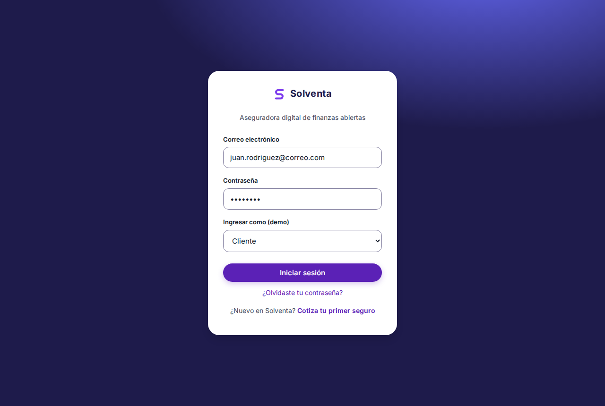

1. Escribe tu correo y contraseña.
2. En **Ingresar como (demo)** deja **Cliente**. (Las opciones Operaciones y Socio de distribución se explican en las secciones 12 y 13.)
3. Pulsa **Iniciar sesión**.

¿Olvidaste la contraseña? Pulsa **¿Olvidaste tu contraseña?**, escribe tu correo y recibirás un enlace válido por 15 minutos.

## 2. Inicio

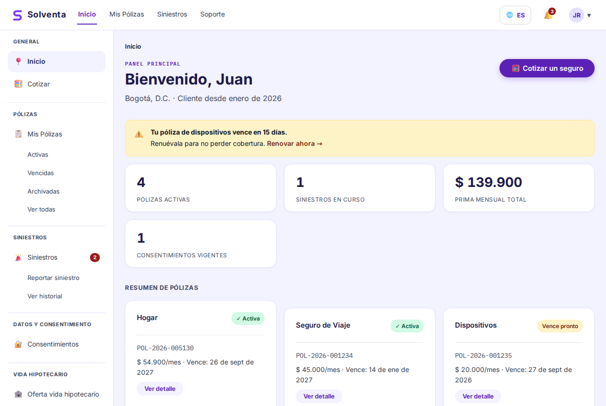

Muestra tus pólizas activas, siniestros en curso, prima mensual total y consentimientos vigentes. Si una póliza está por vencer, verás un aviso con el enlace **Renovar ahora**. La campana 🔔 de la barra superior reúne tus notificaciones.

El menú de la izquierda agrupa todo por tema: Cotizar, Pólizas, Siniestros, Consentimientos, Vida hipotecario y Cuenta. En pantallas pequeñas se abre con el botón ☰.

## 3. Consentimiento de datos financieros

Solventa puede ofrecerte un precio más justo si autorizas el uso de tus datos financieros (comportamiento de pago, endeudamiento y estabilidad de ingresos) a través de **Open Finance**. Tú decides.

**Otorgar un consentimiento**
1. Ve a **Consentimientos**.
2. En *Otorgar un nuevo consentimiento*, elige tu entidad financiera y el alcance.
3. Marca la casilla de autorización y pulsa **Otorgar consentimiento**. Queda vigente por 12 meses.

**Ver cómo se han usado tus datos:** pulsa **Ver historial de uso** en el consentimiento.

**Revocar:** pulsa **Revocar consentimiento** y confirma. Dejamos de usar tus datos en menos de 5 minutos. Tus pólizas vigentes no se afectan; las nuevas cotizaciones usarán el precio estándar.

## 4. Cotizar un seguro

1. Pulsa **Cotizar** (menú o botón *Cotizar un seguro* del inicio).
2. **Producto:** elige Auto, Hogar, Viaje o Dispositivos.
3. **Tus datos:** revisa nombre, documento y valor asegurado. No podrás continuar si falta un dato obligatorio.
4. **Open Finance:** deja el interruptor encendido para un precio personalizado. Si no tienes consentimiento vigente, el interruptor aparece desactivado y verás un enlace para otorgarlo; al terminar vuelves a la cotización.
5. **Tu oferta:** revisa precio, coberturas y cuánto ahorras frente al precio estándar.

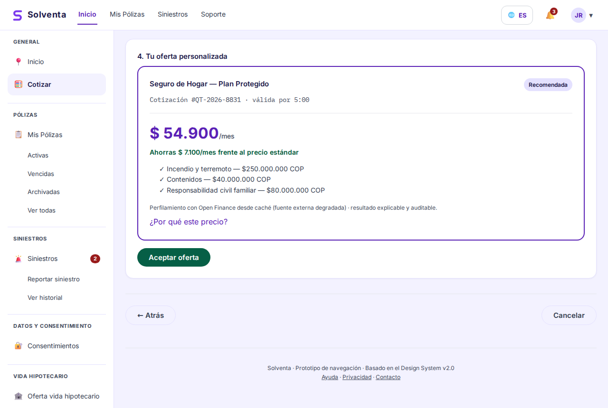

- **¿Por qué este precio?** muestra los factores que influyeron en tu prima.
- La oferta es válida por **5 minutos** (verás la cuenta regresiva). Si vence, pulsa **Recotizar**.
- Si tu banco tarda en responder, cotizamos con tu perfil guardado más reciente y te lo indicamos con un aviso amarillo.

Cuando estés conforme, pulsa **Aceptar oferta**.

## 5. Comprar y recibir tu póliza

La suscripción tiene cuatro pasos:

1. **Revisar oferta.** Confirma las condiciones. Verás la *Decisión de suscripción*: normalmente **Aprobada automáticamente**. Si dice **En revisión asistida**, un analista revisará tu caso (máximo 4 horas) y te avisaremos.

   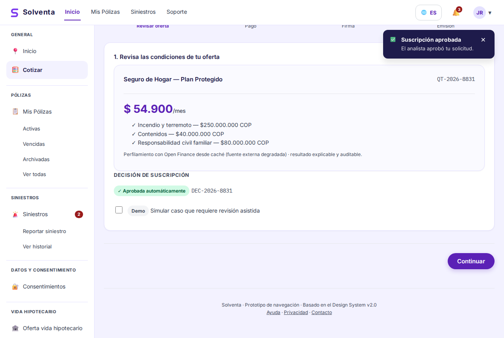

2. **Pago.** Revisa la tarjeta y pulsa **Pagar**. Si el banco rechaza el pago, verás el motivo y la confirmación de que **no se hizo ningún cobro**; puedes intentar de nuevo sin riesgo de doble cobro.
3. **Firma.** Pulsa **Firmar electrónicamente**, lee el resumen, acepta los términos y pulsa **Aceptar y firmar**.
4. **Emisión.** Recibes el número de póliza, la vigencia y el documento en PDF.

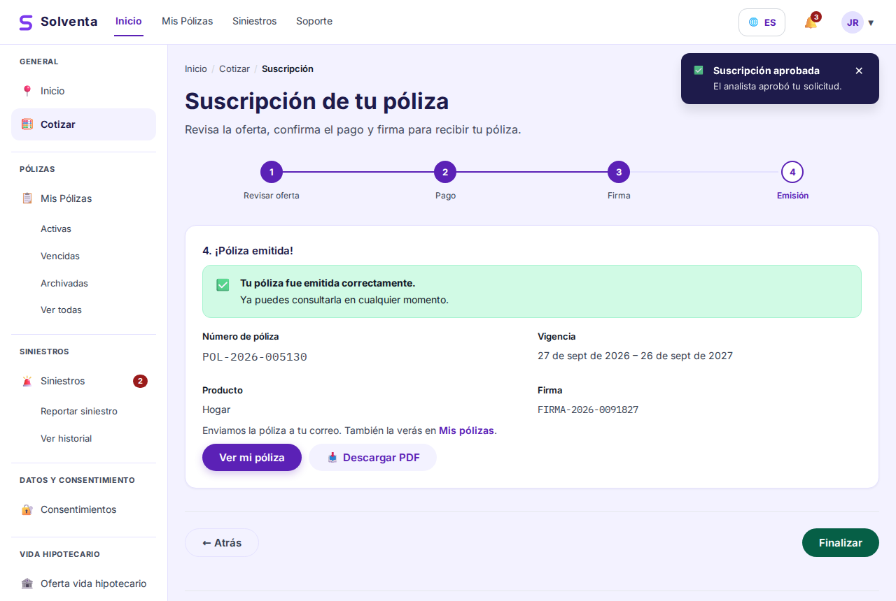

Tu nueva póliza aparece de inmediato en **Mis pólizas** y en el inicio, marcada como *Nueva*.

## 6. Consultar tus pólizas

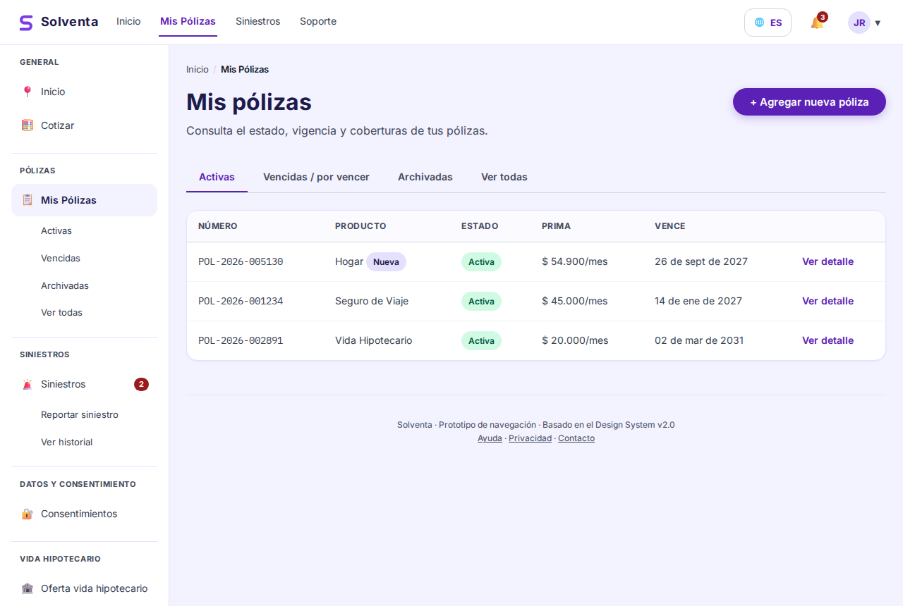

Las pestañas separan pólizas **Activas**, **Vencidas / por vencer** y **Archivadas**. **Ver detalle** muestra vigencia, coberturas, forma de pago, historial de pagos y el PDF.

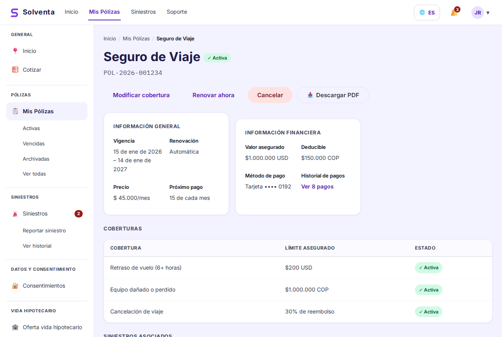

## 7. Modificar, renovar o cancelar una póliza

Desde el detalle de la póliza:

- **Modificar cobertura:** marca o desmarca coberturas y adicionales; el nuevo precio se calcula mientras eliges. Debe quedar al menos una cobertura.
- **Renovar:** revisa la nueva vigencia y la nueva prima y pulsa **Aceptar renovación**.
- **Cancelar:** marca la casilla *Entiendo las consecuencias…* y confirma en la ventana. Esta acción no se puede deshacer; la póliza queda como *Cancelada* y ya no permite cambios.

## 8. Reportar un siniestro

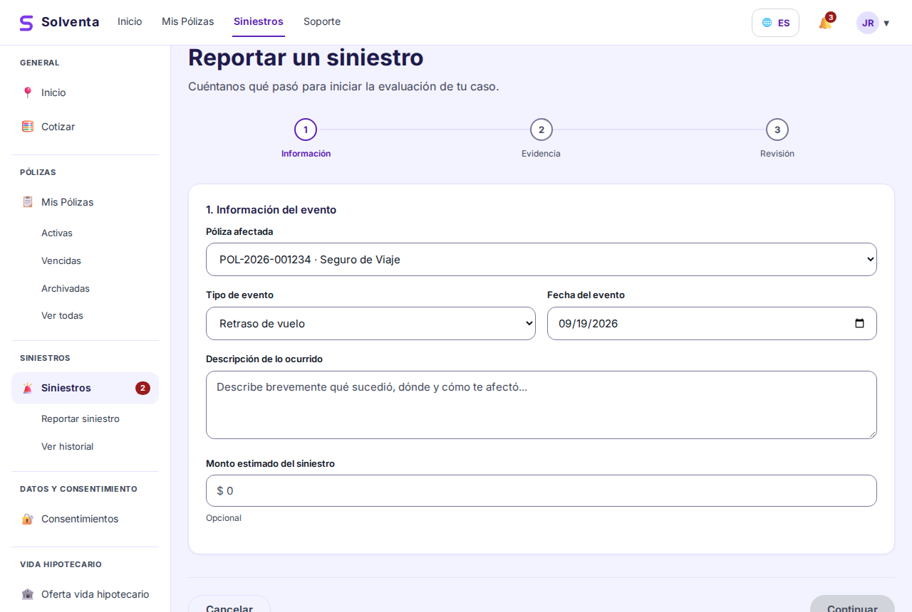

1. Ve a **Siniestros → Reportar siniestro**.
2. **Información:** elige la póliza afectada y el tipo de siniestro, y cuéntanos qué pasó y cuándo.
3. **Evidencia:** adjunta fotos, facturas o certificados.
4. **Revisión:** verifica el resumen y pulsa **Enviar reporte**.

Recibirás un número de reclamo (`CLM-…`) y el estado **Pendiente revisión**.

## 9. Seguir tus siniestros

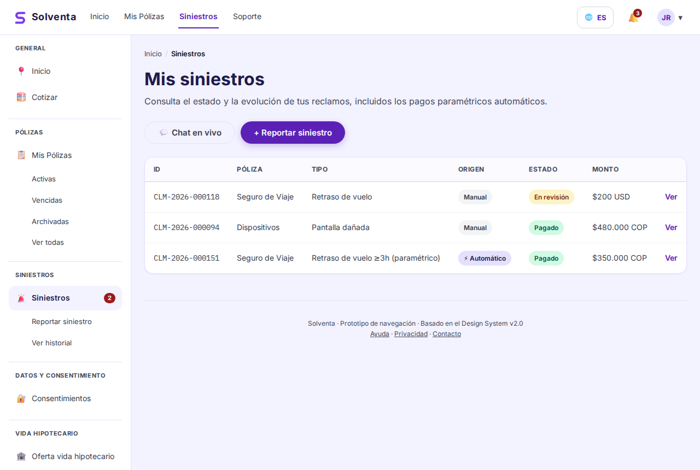

La lista muestra cada reclamo con su origen, estado y monto. **Ver** abre la línea de tiempo con cada etapa (recibido, validado, en evaluación, decisión y pago).

- **⚡ Automático (paramétrico):** algunos seguros pagan solos cuando ocurre un evento verificable, por ejemplo un vuelo con 3 horas o más de retraso. No tienes que reclamar; verás el evento detectado y el pago.
- **💬 Chat en vivo:** habla con un asesor sobre tu caso.

## 10. Oferta de vida hipotecario

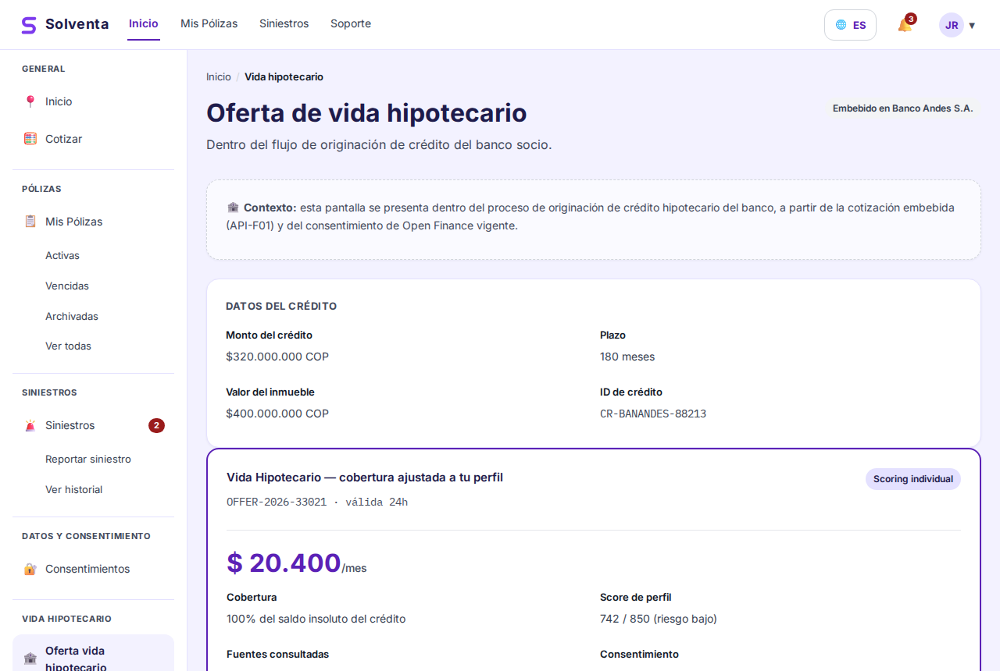

Si solicitas un crédito hipotecario con un banco aliado, verás esta oferta dentro del proceso del banco. Con consentimiento vigente el precio se ajusta a tu perfil; sin él, se muestra la tarifa estándar y un enlace para otorgarlo. **Ver condiciones completas** detalla beneficiario, vigencia y exclusiones. **Suscribir en un clic** te lleva a la compra (sección 5).

## 11. Perfil, configuración y ayuda

- **Mi perfil:** actualiza tus datos y pulsa **Guardar cambios**. Si el correo no es válido, se marca el campo y se explica el error.
- **Configuración:** activa o desactiva notificaciones por correo, push y recordatorios de vencimiento; cambia el idioma (Español / English).
- **Ayuda:** preguntas frecuentes con buscador, chat en vivo, línea 01 8000 123 456 y soporte@solventa.co.

---

# Web · equipos internos

## 12. Tablero operacional

Para el equipo de **Operaciones**. Inicia sesión con **Ingresar como → Operaciones**.

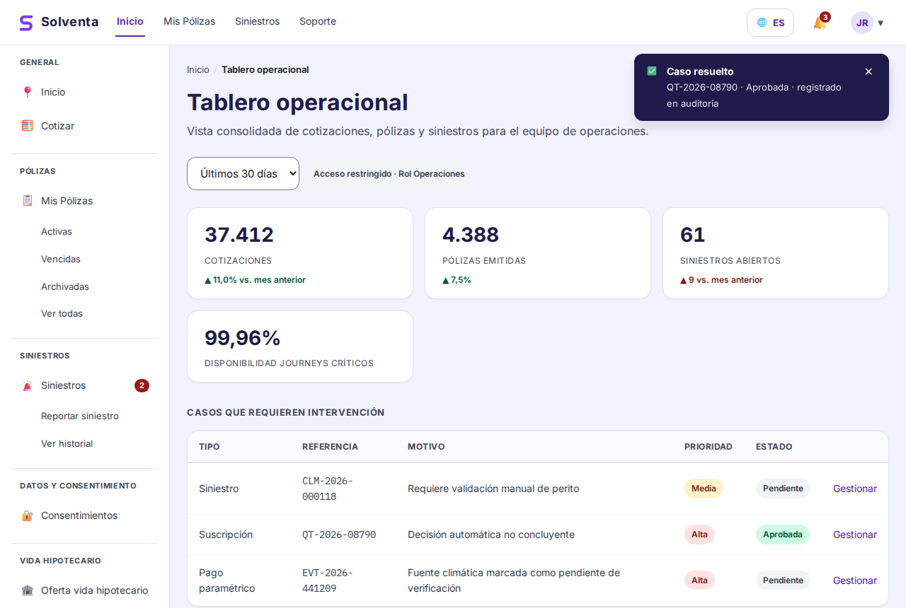

1. Elige el periodo (**Hoy**, **Últimos 7 días**, **Últimos 30 días**) para ver cotizaciones, pólizas emitidas, siniestros abiertos y disponibilidad.
2. En **Casos que requieren intervención**, pulsa **Gestionar**:
   - *Siniestro:* asignar perito o aprobar el pago.
   - *Suscripción no concluyente:* rechazar o aprobar con recargo.
   - *Pago paramétrico con fuente pendiente:* retener o verificar y liberar los pagos.
3. Escribe una nota para la auditoría y elige la acción. El caso queda con su nuevo estado.

Si entras con una sesión de cliente, verás el aviso *No tienes permisos para ver esta sección*.

## 13. Portal de socios de distribución

Para bancos y comercios aliados que venden seguros de Solventa. Inicia sesión con **Ingresar como → Socio de distribución**.

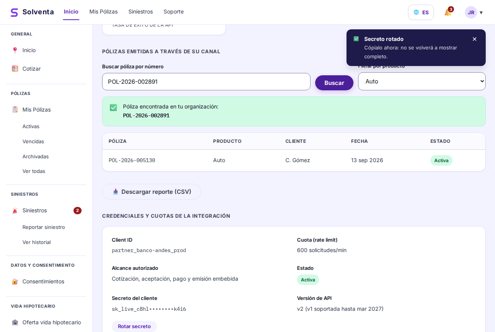

- **Indicadores** de tu canal: cotizaciones vía API, pólizas emitidas, prima colocada y tasa de éxito.
- **Buscar póliza por número** y **Filtrar por producto.** Solo verás pólizas de tu organización: si buscas una de otro canal, aparece *403 · Acceso denegado*.
- **Descargar reporte (CSV)** del periodo.
- **Credenciales:** Client ID, cuota, alcance, versión de API y **Rotar secreto** (el secreto anterior funciona 24 horas más para que actualices tus integraciones).

---

# App móvil

## 14. Crear tu cuenta

En la pantalla de ingreso pulsa **Crear cuenta**.

| 1. Tus datos | 2–3. Selfie y verificación |
|---|---|
|  |  |

1. **Datos:** nombre, cédula, correo y celular; acepta los términos y la política de datos.
2. **Selfie:** toca el visor para tomar la foto con prueba de vida.
3. **KYC:** esperamos unos segundos mientras validamos tu identidad.
4. **Biometría:** activa el ingreso con huella o con rostro. Si tu celular no tiene biometría, usarás un PIN.
5. **Listo:** pulsa **Ir a mi inicio**.

## 15. Ingresar a la app

| Correo y contraseña | Con huella |
|---|---|
|  |  |

Pulsa **Iniciar sesión**, o **👆 Ingresar con huella** y apoya el dedo en el sensor. Si la huella no funciona, elige **Usar PIN**.

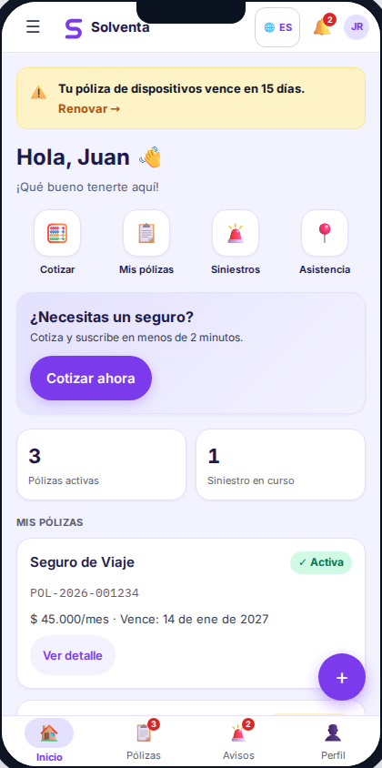

## 16. Cotizar y comprar desde el celular

1. Toca **Cotizar** en el inicio.
2. Elige Dispositivos, Viaje u Hogar.
3. Revisa tus datos y decide si usar **Open Finance** para un precio personalizado.
4. Revisa la oferta (precio, coberturas, **¿Por qué este precio?**).
5. En **Pago** pulsa **Pagar y emitir póliza**.

| Oferta | Póliza emitida |
|---|---|
| 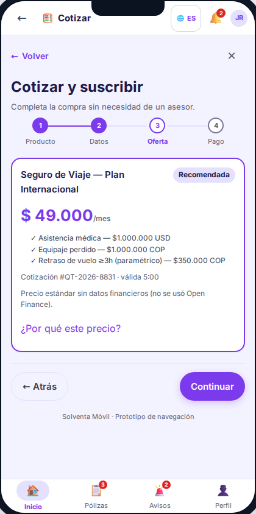 | 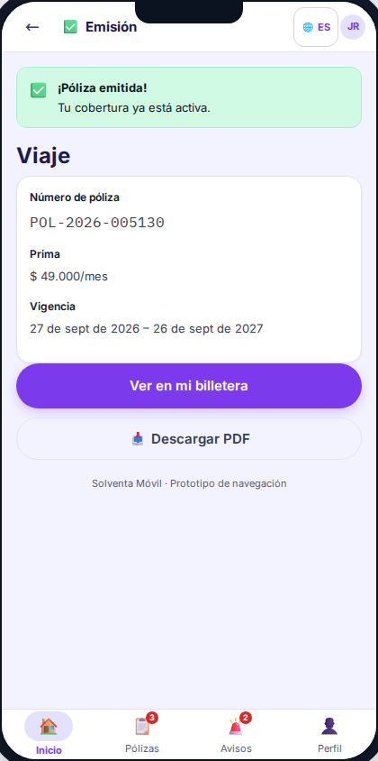 |

La póliza queda de inmediato en tu **billetera**.

## 17. Billetera de pólizas y modo sin conexión

Toca **Pólizas** en la barra inferior. Cada póliza tiene su **credencial digital** con número y vigencia, útil para mostrarla en un taller o una clínica.

| Billetera sin conexión | Credencial sin conexión |
|---|---|
| 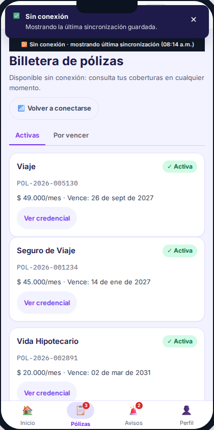 | 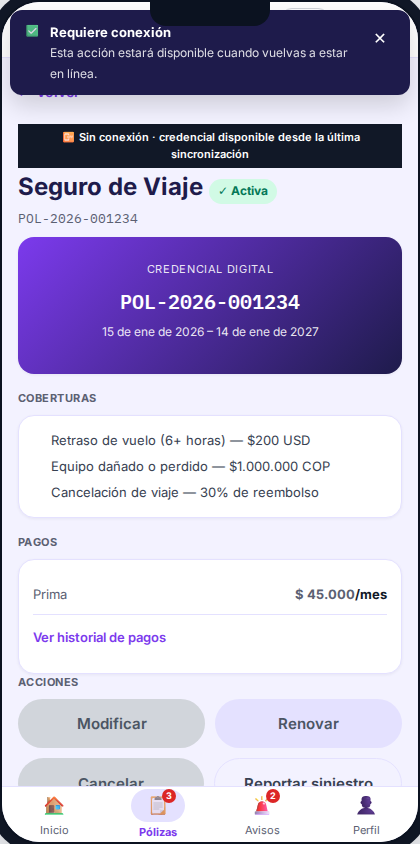 |

**Sin internet** puedes seguir viendo tus pólizas y coberturas desde la última sincronización (lo indica la franja oscura superior). Las acciones que necesitan conexión (modificar, renovar, cancelar) aparecen en gris y, si las tocas, te lo explicamos. En la demo usa **📴 Simular modo sin conexión** y **📶 Volver a conectarse**.

## 18. Siniestros desde el celular

| Reportar con fotos | Mis siniestros | Pago automático |
|---|---|---|
| 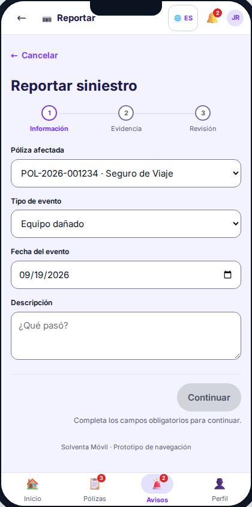 | 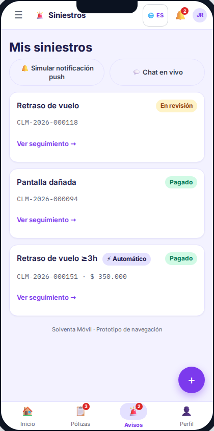 | 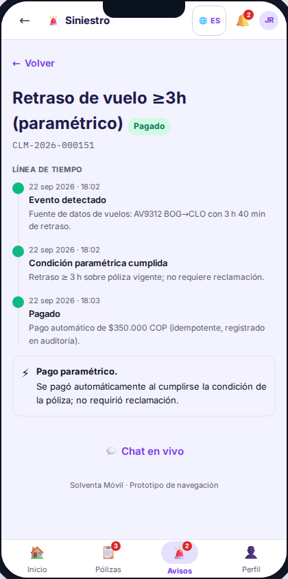 |

Reporta en tres pasos (**Información**, **Evidencia** con la cámara o archivos, **Revisión**), pulsa **Enviar reporte** y sigue el estado en **Mis siniestros**. Los pagos automáticos muestran el evento que los activó.

## 19. Asistencia en sitio

| Permiso de ubicación | Asistencia en camino |
|---|---|
| 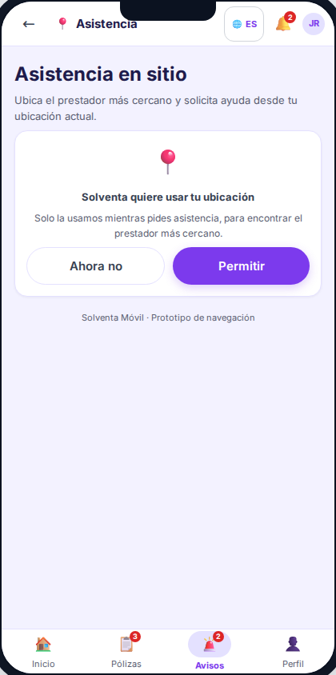 | 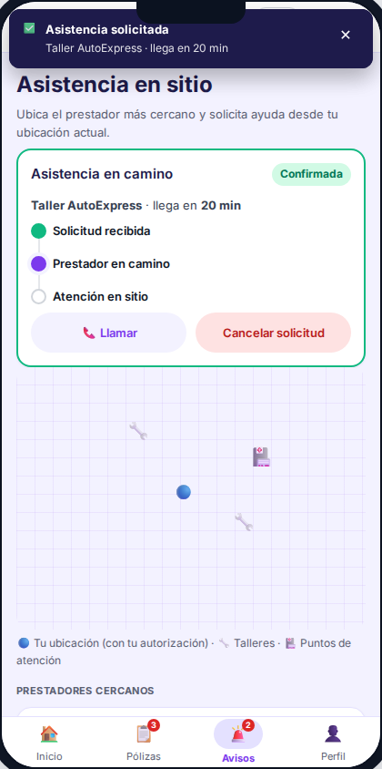 |

1. Abre **Asistencia** desde el inicio.
2. Pulsa **Permitir** para usar tu ubicación. Si prefieres no compartirla, toca **Ahora no** y escribe tu dirección.
3. Elige un prestador cercano, pulsa **Solicitar asistencia**, selecciona la póliza y qué necesitas, y confirma.
4. Sigue la llegada en la tarjeta **Asistencia en camino**. Puedes **Llamar** al prestador o **Cancelar solicitud**.

## 20. Escanear documentos

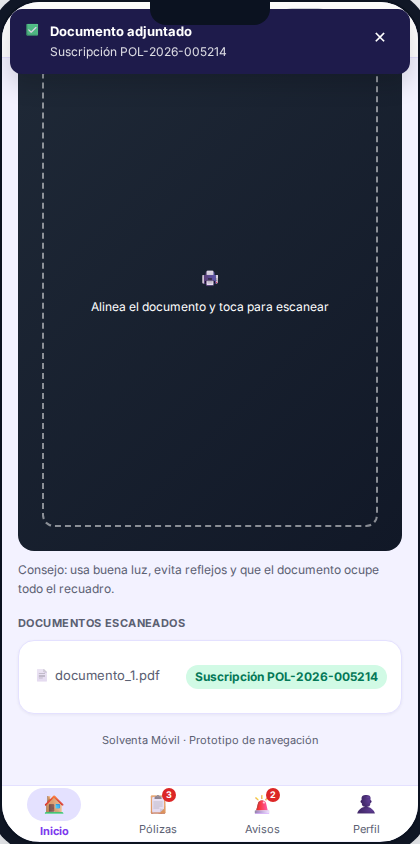

1. Abre **Escanear documento** desde el menú ☰.
2. Alinea el documento dentro del recuadro (buena luz, sin reflejos) y toca para escanear.
3. Elige a qué trámite lo asocias y pulsa **Adjuntar documento**. Si no quedó bien, pulsa **Repetir**.

Tus documentos quedan en **Documentos escaneados**.

## 21. Notificaciones

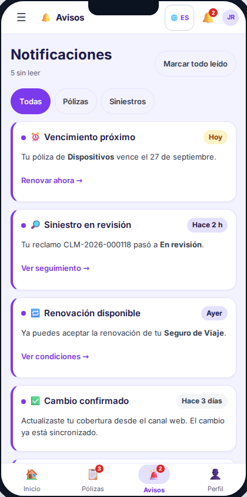

Toca **Avisos** en la barra inferior. Las notificaciones sin leer tienen un punto y un borde de color. Filtra por **Pólizas** o **Siniestros**, toca una para marcarla como leída o usa **Marcar todo leído**. Cada aviso lleva a su acción: por ejemplo, **Renovar ahora** abre la renovación de esa póliza. Ajusta qué avisos recibes en **⚙️ Preferencias de notificación**.

---

## Mensajes que puedes ver y qué hacer

| Mensaje | Qué significa | Qué hacer |
|---|---|---|
| *Completa los campos obligatorios para continuar.* | Falta un dato en el paso actual. | Llena los campos vacíos; el botón **Continuar** se habilita solo. |
| *No tienes un consentimiento vigente.* | No autorizaste el uso de tus datos financieros. | Cotiza con precio estándar u otorga el consentimiento desde el enlace. |
| *Fuente externa degradada.* | Tu banco tardó en responder. | Nada: usamos tu perfil guardado y la cotización sigue normalmente. |
| *La cotización venció.* | Pasaron los 5 minutos de garantía del precio. | Pulsa **Recotizar**. |
| *En revisión asistida* | Tu solicitud necesita revisión de un analista. | Espera la notificación (máximo 4 horas). |
| *Pago rechazado por el banco emisor.* | El banco no aprobó el cobro. No se cobró nada. | Verifica los datos o usa otro medio e intenta de nuevo. |
| *Requiere conexión* | Estás sin internet. | Vuelve a intentarlo cuando tengas conexión. |
| *403 · Acceso denegado* (socios) | La póliza no pertenece a tu organización. | Verifica el número; solo ves pólizas de tu canal. |
| *No tienes permisos para ver esta sección.* | Tu usuario no tiene ese rol. | Ingresa con el usuario correspondiente. |

## Accesibilidad e idioma

- **Idioma:** botón 🌐 **ES/EN** en la barra superior o **Configuración → Idioma**. Montos y fechas se ajustan al idioma.
- **Teclado:** todo se puede usar con Tab, Enter, Espacio y Escape. Al inicio de cada pantalla, **Saltar al contenido principal** evita recorrer el menú.
- **Lectores de pantalla:** los avisos, los pasos de los asistentes y los resultados de cada acción se anuncian automáticamente.
- **Tamaño táctil:** en el celular todos los botones miden al menos 44×44 px.
