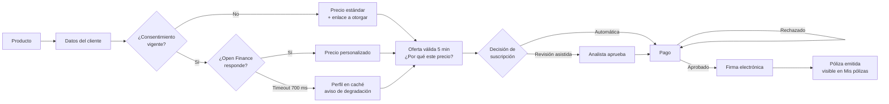

# Solventa · Patrones de diseño UI/UX (web y móvil)

Documentación técnica de los patrones de interfaz y experiencia de usuario aplicados en los mockups navegables de Solventa (`web/` y `mobile/`). Complementa al [Design System v2](../DesignSystem/Solventa_Design_System.md) (tokens, componentes base) y al [Sistema de Navegación](../DesignSystem/Solventa_Navigation_System.md) (estructura de navegación). Este documento responde tres preguntas: **qué patrón se usó, qué problema resuelve y cómo está implementado**, con trazabilidad a las features del backlog y a los requisitos de calidad (RC).

- **Audiencia:** equipo de desarrollo (frontend web y móvil), evaluadores del curso.
- **Alcance:** 20 pantallas web y 21 pantallas móviles, que cubren las 20 features del backlog (WEB-F01..F11, MOB-F01..F09).
- **Naturaleza:** prototipo de navegación. No hay backend; las integraciones (Open Finance, KYC/AML, pasarela de pago, prestadores) se simulan en el navegador.

---

## 1. Cómo ejecutar los mockups

```bash
cd Proyecto_Grupo_13
python3 -m http.server 8765
# Web:   http://localhost:8765/web/login.html
# Móvil: http://localhost:8765/mobile/login.html
```

Se recomienda servirlos por HTTP (y no abrirlos con `file://`) para que el estado de la demo se comparta entre pantallas. Para reiniciar la demo basta con cerrar la pestaña: todo el estado vive en `sessionStorage`.

---

## 2. Mapa de flujos funcionales

| Feature | Flujo | Pantallas web | Pantallas móviles | Patrones clave |
|---|---|---|---|---|
| WEB-F01 · MOB-F04 | Cotización por producto con Open Finance | `cotizacion` | `cotizar` | P04, P05, P14, P15, P16 |
| WEB-F02 · MOB-F02 | Otorgar, consultar y revocar consentimiento | `consentimientos` | `consentimiento` | P08, P07, P17 |
| WEB-F03 · MOB-F04 | Suscripción: decisión, pago, firma y emisión | `suscripcion` | `cotizar` → `suscripcion` | P04, P10, P18, P14 |
| WEB-F04 · MOB-F03 | Consulta de pólizas y billetera | `polizas`, `poliza-detalle` | `billetera`, `billetera-detalle` | P03, P12, P14 (offline) |
| WEB-F05 · MOB-F05 | Reporte de siniestro asistido / con evidencia | `siniestro-reportar`, `siniestro-confirmacion` | `siniestro-reportar`, `siniestro-confirmacion` | P04, P21 |
| WEB-F06 · MOB-F06 | Seguimiento de siniestros (manual y paramétrico) | `siniestros`, `siniestro-detalle` | `siniestros`, `siniestro-detalle` | P11, P12, P26 |
| WEB-F07/F08/F09 | Renovar, cancelar y modificar póliza | `poliza-renovar`, `poliza-cancelar`, `poliza-modificar` | ídem | P07, P09, P16 |
| WEB-F10 | Tablero operacional | `operaciones` | — | P19, P13, P17 |
| WEB-F11 | Back-office de socios | `socios` | — | P19, P13 |
| Caso vida hipotecario | Oferta embebida en el banco socio | `hipotecario` | — | P16, P14 |
| MOB-F01 | Registro, KYC y biometría | `login` | `login`, `onboarding` | P04, P22, P21 |
| MOB-F07 | Asistencia en sitio | — | `asistencia` | P20, P24 |
| MOB-F08 | Notificaciones de ciclo de vida | campana de la barra superior | `notificaciones` | P23 |
| MOB-F09 | Escaneo de documentos | — | `escaneo` | P21, P13 |
| Transversal | Perfil, configuración, ayuda | `perfil`, `configuracion`, `ayuda` | ídem | P06, P09, P26, P25 |

### 2.1 Recorrido crítico de venta



Cada rama del diagrama puede recorrerse en la demo mediante los controles marcados como **Demo** (ver P28).

---

## 3. Catálogo de patrones

Formato de cada ficha: **Problema** → **Solución** → **Dónde** → **Implementación** → **Accesibilidad**.

### 3.1 Navegación y estructura

**P01 · Contenedor de aplicación (app shell) por canal**
- **Problema:** el usuario debe orientarse en una aplicación con más de 20 pantallas y dos canales con capacidades distintas.
- **Solución:** web con barra superior + menú lateral agrupado por dominio (General, Pólizas, Siniestros, Datos y consentimiento, Backoffice, Cuenta); móvil con encabezado, **navegación inferior** de 4 destinos y **menú lateral (drawer)** para el resto.
- **Dónde:** todas las pantallas.
- **Implementación:** `.topbar`, `.sidebar`, `.nav-group` (web); `.app-header`, `.bottom-nav`, `.drawer` (móvil). En web, por debajo de 1024 px el menú lateral se vuelve drawer (botón ☰).
- **Accesibilidad:** enlace “Saltar al contenido principal”, `aria-current="page"` en el destino activo, drawer con `role="dialog"`, trampa de foco y retorno de foco al cerrar (`app.js` §1).

**P02 · Migas de pan y barra de flujo**
- **Problema:** en tareas de varias pantallas el usuario pierde el camino de vuelta.
- **Solución:** migas de pan en web (`Inicio / Cotizar / Suscripción`); en móvil una barra de flujo con “← Volver” y “✕” para abandonar.
- **Implementación:** `.breadcrumb` (web), `.flow-bar` con `.back-link` / `.close-link` (móvil).

**P03 · Pestañas**
- **Problema:** listas largas con estados distintos (activas, por vencer, archivadas).
- **Solución:** pestañas que filtran sin cambiar de pantalla; el hash de la URL (`polizas.html#vencidas`) abre la pestaña correspondiente desde el menú.
- **Implementación:** `[data-tabs]`, `[data-tab]`, `[data-tab-panel]`.
- **Accesibilidad:** patrón WAI-ARIA `tablist/tab/tabpanel`, flechas, Inicio y Fin (`app.js` §3).

### 3.2 Entrada de datos y tareas

**P04 · Asistente paso a paso con puertas de validación**
- **Problema:** cotizar, suscribir, reportar un siniestro o registrarse exige muchos datos; un formulario único abruma y aumenta el abandono.
- **Solución:** dividir la tarea en 3–5 pasos con indicador de progreso. El botón **Continuar** se bloquea hasta que el paso actual esté completo y se muestra por qué.
- **Dónde:** cotización, suscripción, reporte de siniestro, onboarding.
- **Implementación:** contenedor `[data-wizard]` con `.stepper` y `.wizard-step`. Cada paso declara sus requisitos con `data-required="id1,id2"`; `flow.js#gates()` deshabilita Continuar y muestra “Completa los campos obligatorios”. Las condiciones que no son campos (pago aprobado, selfie capturada, KYC terminado, decisión de suscripción) se modelan con un `<input type="hidden">` que el flujo llena al cumplirse.
- **Reglas:** no hay “Atrás” en el primer paso ni “Continuar” en el último (sin callejones); el último paso ofrece la acción final (Finalizar, Ir a mi inicio).
- **Accesibilidad:** `aria-current="step"`, anuncio “Paso X de N: etiqueta” en una región `aria-live` y foco en el título del paso.

**P05 · Tarjetas de opción**
- **Problema:** elegir un producto entre varios con información de apoyo.
- **Solución:** radios presentados como tarjetas con ícono, nombre y descripción corta; la tarjeta completa es el área de clic.
- **Implementación:** `[data-option-group]` + `.option-card` con `<input type="radio" value="auto|hogar|viaje|disp">`. El `value` determina la oferta.

**P06 · Validación en línea**
- **Problema:** errores descubiertos solo al enviar.
- **Solución:** validar al enviar el formulario o guardar, marcar el campo y explicar la corrección en lenguaje simple (“Ingresa un correo válido.”).
- **Dónde:** inicio de sesión, perfil.
- **Implementación:** `aria-invalid="true"` sobre el campo (estilo de error en CSS) y mensaje `.error-text` asociado con `aria-describedby`; el foco regresa al campo con error.

**P07 · Confirmación de acciones destructivas o irreversibles**
- **Problema:** cancelar una póliza o revocar un consentimiento por error.
- **Solución:** dos barreras: una casilla de reconocimiento (“Entiendo las consecuencias y confirmo que deseo cancelar esta póliza”) y un **diálogo de confirmación** que nombra el objeto afectado y la consecuencia. El botón destructivo usa color de error y el alternativo es “Volver/Cancelar”.
- **Dónde:** cancelar póliza, revocar consentimiento, cancelar solicitud de asistencia, rotar secreto de socio.
- **Implementación:** `Solv.modal({title, html, buttons})` devuelve una promesa con el botón pulsado.
- **Accesibilidad:** `role="dialog"`, `aria-modal`, foco inicial, trampa de foco, Escape cierra y el foco vuelve al disparador.

**P08 · Consentimiento explícito y revocable**
- **Problema:** usar datos financieros del cliente exige autorización explícita, auditable y revocable (Decreto 1297 de 2022).
- **Solución:** explicar qué datos se usan y para qué; el botón **Otorgar** permanece deshabilitado hasta marcar la autorización; cada consentimiento muestra alcance, entidad, fechas e ID, con **Ver historial de uso** y **Revocar** (efectivo en ≤ 5 min).
- **Efecto transversal:** si no hay consentimiento vigente, la cotización y la oferta hipotecaria desactivan Open Finance, muestran precio estándar y ofrecen un enlace para otorgarlo que **regresa al flujo de origen** (`consentimientos.html?back=cotizacion`).
- **RC:** RC-04 (revocación ≤ 5 min), RC-08 (registro de auditoría).

### 3.3 Retroalimentación y estado

**P09 · Notificación efímera (toast)**
- **Problema:** confirmar que una acción ocurrió sin interrumpir.
- **Solución:** mensaje con título y detalle en la esquina superior, que desaparece solo a los 4,5 s y se puede cerrar.
- **Implementación:** `Solv.toast(título, detalle)`; al volver de un flujo, `?ok=clave` muestra el resultado en la pantalla de destino.
- **Accesibilidad:** `role="status"` (lectores de pantalla lo anuncian sin mover el foco).

**P10 · Botón ocupado**
- **Problema:** doble clic en operaciones lentas (pago, registrar consentimiento, guardar).
- **Solución:** mientras la operación corre, el botón se deshabilita y cambia su texto (“Procesando pago…”).
- **Implementación:** `busy(btn, texto, ms, fn)` en `features.js`; `aria-busy="true"`.

**P11 · Línea de tiempo de estado**
- **Problema:** el cliente necesita saber en qué va su siniestro o su asistencia.
- **Solución:** hitos con fecha, título y descripción; estados *hecho*, *actual* y *pendiente*. Los siniestros paramétricos muestran el evento detectado y la condición cumplida.
- **Implementación:** `.timeline` + `.tl-item.done|.current`. El detalle se elige por ID (`siniestro-detalle.html?id=CLM-2026-000151`).

**P12 · Insignias de estado con texto**
- **Problema:** comunicar estado de un vistazo sin depender del color.
- **Solución:** insignia con color semántico **y** texto (“✓ Activa”, “Vence pronto”, “Cancelada”, “Pendiente revisión”, “⚡ Automático”).
- **Implementación:** `.badge.success|warning|error|neutral`.

**P13 · Estado vacío**
- **Problema:** una lista o filtro sin resultados parece un error.
- **Solución:** mensaje explicativo y una salida (“No hay pólizas para este filtro”, “Aún no has escaneado documentos”, “Prueba el chat en vivo”).
- **Implementación:** `.empty-state`.

**P14 · Degradación elegante**
- **Problema:** las dependencias externas fallan (Open Finance lento, sin conexión en el celular) y el usuario no debe quedar bloqueado.
- **Solución:** seguir funcionando con un valor de respaldo y **decirlo**:
  - *Open Finance no responde:* la cotización usa el perfil en caché y lo explica (“Fuente externa degradada… perfil en caché de hace 2 h”).
  - *Sin conexión (móvil):* la billetera muestra la última sincronización; las acciones que requieren red (modificar, renovar, cancelar) se ven deshabilitadas y, si se tocan, explican por qué.
  - *Sin consentimiento:* precio estándar en lugar de error.
- **Implementación:** `#ofDegraded`, `#offlineBanner`, atributo `[data-online-only]`.
- **RC:** RC-01 (latencia: no esperar más de 700 ms) y RC-03 (disponibilidad ante dependencia caída).

**P15 · Oferta con vigencia**
- **Problema:** el precio cotizado solo se garantiza unos minutos.
- **Solución:** cuenta regresiva visible (“válida por 4:32”); al vencer se bloquea **Aceptar oferta** y se ofrece **Recotizar**.
- **Implementación:** `offerTimer()` en `features.js`; solo corre mientras el paso de oferta está visible.

### 3.4 Confianza y transparencia

**P16 · Explicabilidad del precio**
- **Problema:** un precio personalizado con datos financieros genera desconfianza si no se explica.
- **Solución:** enlace **¿Por qué este precio?** junto a la oferta: tabla de factores y su efecto (comportamiento de pago −6 %, siniestralidad de la zona +1 %, …), versión del modelo y nota de auditoría. La oferta indica además cuánto ahorra frente al precio estándar.
- **RC:** RC-08 (explicabilidad y trazabilidad).

**P17 · Trazabilidad visible**
- **Problema:** operaciones y clientes necesitan referenciar casos.
- **Solución:** identificadores legibles y consistentes en tipografía monoespaciada: `QT-` (cotización), `DEC-` (decisión), `TX-` (pago), `FIRMA-`, `POL-`, `CLM-`, `EVT-`, `CONSENT-`. Las decisiones de operaciones piden una nota para la auditoría.

**P18 · Idempotencia comunicada**
- **Problema:** el miedo a que un reintento cobre dos veces.
- **Solución:** mensaje explícito (“reintentar el pago no genera doble cobro”); si el pago es rechazado se aclara que no hubo cobro y se permite reintentar. La emisión es idempotente por cotización: volver a la pantalla de emisión no crea una segunda póliza.
- **RC:** RC-03 (cero pérdida y cero duplicados en recaudo).

### 3.5 Control de acceso

**P19 · Puerta de rol y aislamiento por socio**
- **Problema:** el tablero operacional y el back-office de socios no deben verse con una sesión de cliente, y un socio no puede ver datos de otro.
- **Solución:** si el rol no corresponde, el contenido se oculta y aparece un aviso de permisos (en la demo, con un botón para cambiar de rol). En el back-office, buscar una póliza de otro canal devuelve **403 · Acceso denegado** con la explicación.
- **Implementación:** `roleGate()` lee `solv_role` (fijado en el inicio de sesión con “Ingresar como”); `[data-role-content]`, `#roleGate`, `#partnerResult`.

### 3.6 Capacidades nativas del móvil

**P20 · Permiso en contexto con alternativa**
- **Problema:** pedir la ubicación al abrir la app genera rechazo.
- **Solución:** pedirla solo al entrar a Asistencia, explicando para qué; si el usuario dice “Ahora no”, ofrecer escribir la dirección.

**P21 · Captura guiada (cámara y escáner)**
- **Problema:** fotos ilegibles de documentos o evidencias.
- **Solución:** visor con guía de encuadre, consejo de iluminación y confirmación de legibilidad; opción de repetir. Se usa en selfie con prueba de vida, evidencia de siniestro y escaneo de documentos.
- **Implementación:** `[data-camera-mock="idResultado"]` (operable con Enter/Espacio).

**P22 · Autenticación biométrica con respaldo**
- **Problema:** no todos los equipos tienen biometría o esta puede fallar.
- **Solución:** “Ingresar con huella” abre el diálogo del sensor, con **Usar PIN** como alternativa; el onboarding permite activar huella o rostro.

**P23 · Bandeja de notificaciones**
- **Problema:** avisos de vencimientos, renovaciones y siniestros mezclados.
- **Solución:** indicador de no leídas (punto y borde), contador (“5 sin leer”), filtros (Todas, Pólizas, Siniestros), **Marcar todo leído** y enlace directo a la acción (renovar la póliza exacta, ver el siniestro).
- **Accesibilidad:** filtros con `aria-pressed`, contador en `aria-live`.

**P24 · Seguimiento en vivo**
- **Problema:** después de pedir ayuda, el usuario no sabe si viene alguien.
- **Solución:** tarjeta de seguimiento con prestador, tiempo estimado, línea de tiempo, **Llamar** y **Cancelar solicitud**.

### 3.7 Transversales

**P25 · Internacionalización y localización**
- **Solución:** selector ES/EN en la barra superior y en Configuración; montos (COP) y fechas se formatean con `Intl` según el idioma (es-CO / en-US). La preferencia persiste en `localStorage`.
- **Implementación:** textos con `[data-i18n]` se traducen por coincidencia exacta con `EN_DICT` (`i18n.js`); montos con `[data-money]`, fechas con `[data-date]`. Los textos generados por JavaScript usan `Solv.t(es, en)`.

**P26 · Ayuda en contexto**
- **Solución:** chat en vivo disponible desde siniestros y ayuda; preguntas frecuentes en acordeón (`<details>`) con buscador y estado vacío que remite al chat.

**P27 · Estado compartido entre pantallas (patrón de prototipo)**
- **Problema:** un mockup estático no demuestra que una acción en una pantalla se refleja en otra.
- **Solución:** un estado mínimo en `sessionStorage` que todas las pantallas leen: la póliza emitida aparece en Mis pólizas, Inicio y la billetera; un consentimiento revocado cambia la cotización; un caso resuelto conserva su estado.
- **Nota:** no es la arquitectura del producto; en la implementación real este estado vive en el backend y llega por el BFF de cada canal.

**P28 · Controles de demostración marcados**
- **Problema:** mostrar los caminos alternos (errores, degradación, revisión manual) sin un backend.
- **Solución:** casillas con la insignia **Demo** que fuerzan cada escenario: “Simular que Open Finance no responde”, “Simular caso que requiere revisión asistida”, “Simular pago rechazado”, “Simular modo sin conexión”, “Simular notificación push”. Se distinguen visualmente para no confundirse con funciones del producto.

---

## 4. Accesibilidad (WCAG 2.2 AA)

| Criterio | Técnica aplicada |
|---|---|
| 1.3.1 Información y relaciones | `label for` en todos los campos, `scope="col"` en tablas, roles ARIA en pestañas, asistentes y diálogos |
| 1.4.1 Uso del color | Insignias y alertas siempre con texto o ícono además del color |
| 1.4.3 Contraste | Mínimo 4,5:1 (tokens del Design System v2) |
| 2.1.1 Teclado | Todo es operable con Tab, Enter, Espacio, Escape y flechas (pestañas, menús) |
| 2.4.1 Evitar bloques | Enlace “Saltar al contenido principal” |
| 2.4.3 Orden del foco | Trampa y retorno de foco en diálogos y drawer; foco al título de cada paso del asistente |
| 2.4.4 Propósito del enlace | Enlaces genéricos (“Ver”, “Ver detalle”) reciben el contexto de su fila o tarjeta vía `aria-describedby` |
| 2.5.8 Tamaño del objetivo | Objetivos táctiles ≥ 44×44 px en móvil |
| 3.3.1 Identificación de errores | `aria-invalid` + mensaje textual + foco al campo |
| 4.1.3 Mensajes de estado | Toasts con `role="status"`, anuncios en `#a11yAnnouncer` (`aria-live="polite"`) |

> **Corrección incluida en esta versión:** el contexto de los enlaces genéricos se insertaba como un `<span class="sr-only">` dentro del enlace; al traducir, `i18n.js` reescribía el texto y el contexto quedaba visible (“Renovar ahora → — ⏰ Vencimiento próximo”). Ahora es un elemento hermano referenciado con `aria-describedby`. También se corrigió el toast, que colocaba el texto en lugar del ícono.

---

## 5. Implementación técnica del prototipo

### 5.1 Scripts y orden de carga

Cada pantalla carga, en este orden:

| Archivo | Responsabilidad |
|---|---|
| `flow.js` | Estado de pólizas y reclamos, `modal()`, `toast()`, chat simulado, puertas de validación de asistentes. Expone `window.Solv`. |
| `features.js` | Flujos complementarios: cotización por producto, suscripción, consentimiento, hipotecario, tablero, socios, login/onboarding, asistencia, escaneo, notificaciones, modo sin conexión, cuenta. Cada función se activa solo si su pantalla contiene los elementos que necesita. |
| `i18n.js` | Traducción y formato de montos/fechas. |
| `app.js` | Interacciones genéricas (menús, pestañas, asistente, opciones, zonas de carga) y mejoras de accesibilidad. |

`flow.js` y `features.js` son **idénticos** en `web/` y `mobile/` (se detecta el canal por la presencia de `.device-frame`). Si se modifica uno, copiarlo al otro canal.

### 5.2 Convenciones de atributos `data-*`

| Atributo | Uso |
|---|---|
| `data-wizard`, `data-required` | Asistente y requisitos por paso |
| `data-quote-wizard`, `data-subscribe-wizard`, `data-onboarding` | Activan la lógica del flujo correspondiente |
| `data-offer="name|price|qt|cov|basis|saving"` | Se llenan con la cotización vigente |
| `data-issued="num|name|start|end|link|pdf"` | Se llenan con la póliza emitida |
| `data-issued-rows`, `data-issued-cards` | Contenedores donde se agregan las pólizas emitidas |
| `data-pol-*`, `data-claim-*` | Datos de póliza y reclamo (ver `flow.js`) |
| `data-online-only` | Acción que se bloquea sin conexión |
| `data-case`, `data-partner-pol` | Filas del tablero y del back-office |
| `data-chat`, `data-mock-download` | Abrir chat simulado / descarga simulada |

### 5.3 Claves de estado (`sessionStorage`)

`solv_pol` (cambios a pólizas), `solv_issued` (pólizas emitidas), `solv_quote` (cotización vigente), `solv_consents`, `solv_claims`, `solv_role`, `solv_cases`, `solv_offline`, `solv_assist`, `solv_geo`, `solv_scans`, `solv_read`, `solv_prefs`.

### 5.4 Verificación

Los flujos se verificaron con un recorrido automatizado en Chromium sin interfaz (Playwright): **41 comprobaciones web y 31 móviles, todas aprobadas y sin errores de consola**. Cubren, entre otras: validación del login, revocación de consentimiento y su efecto en la cotización, oferta según producto, degradación de Open Finance, revisión asistida, pago rechazado y aprobado, emisión idempotente, póliza nueva en listas, detalle de siniestros por ID, puerta de rol, 403 entre socios, registro con KYC, billetera sin conexión, asistencia, escaneo y notificaciones.

---

## 6. Trazabilidad patrón → requisito de calidad

| RC | Patrones de UI que lo hacen visible |
|---|---|
| RC-01 Latencia | P14 (no esperar a una dependencia lenta), P15 (vigencia de la cotización) |
| RC-03 Disponibilidad | P14 (caché y modo sin conexión), P18 (idempotencia en pagos) |
| RC-04 Seguridad / consentimiento | P08 (consentimiento explícito y revocable), P19 (rol y aislamiento), P22 (biometría) |
| RC-06 Integración | P19 (credenciales, cuotas y versión de API del socio) |
| RC-08 Trazabilidad / explicabilidad | P16 (¿Por qué este precio?), P17 (identificadores y notas de auditoría), P08 (historial de uso) |
